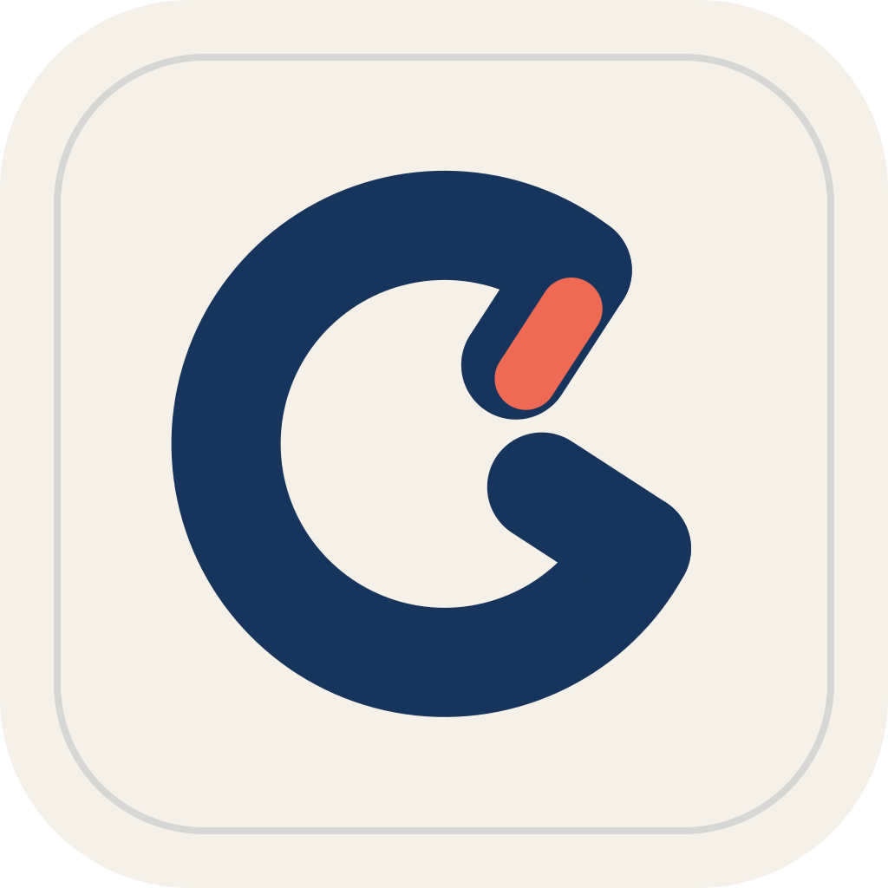

<p align="center">
  
</p>

# Harnss

**把 AI 编程助手、项目上下文和开发工具放进同一个桌面工作区。**

**A desktop workspace for AI coding agents, project context, and development tools.**

[简体中文](#zh-cn) · [English](#en) · [Issues](https://github.com/lihzzz/harnss/issues) · [Builds](https://github.com/lihzzz/harnss/actions) · [MIT](LICENSE)

<a id="zh-cn"></a>

## 简体中文

Harnss 是基于 Electron 与 React 的 AI 编程桌面客户端，面向 macOS、Windows 和 Linux。你可以在一个窗口里运行 Claude Code、Codex、OpenCode 及其他 ACP 兼容代理，管理多个项目和会话，查看工具调用与代码变更，并使用终端、浏览器和 Git 面板完成开发工作。

本说明对应 [lihzzz/harnss](https://github.com/lihzzz/harnss) 的 **`hy_dev` 开发分支**，版本号见 [package.json](package.json)。快捷输入、批量会话操作、多语种语音和语义搜索已接入，但仍有真实代理、录音质量、性能及跨平台安装包验收未完成；具体证据见[实施与验证记录](docs/productivity-enhancements/implementation-status.md)。

[开始使用](#zh-start) · [引擎与可选功能](#zh-config) · [开发与打包](#zh-dev) · [数据与隐私](#zh-data) · [常见问题](#zh-help)

### 主要功能

| 能力 | 可以做什么 |
| --- | --- |
| 多代理会话 | 使用 Claude Agent SDK、Codex app-server 和 ACP 三类引擎；独立保存会话，切换时继续接收后台任务进度。OpenCode 通过内置 ACP 配置接入。 |
| 项目与工作区 | 用 Spaces 组织项目，切换 Git worktree，分屏查看会话，自定义工具面板布局，归档和恢复历史会话。 |
| 可读的执行过程 | 查看流式回复、思考内容、工具卡片、命令输出、逐词差异和每轮文件变更；支持 Markdown、Mermaid 和数学公式。 |
| 集成开发工具 | 多标签终端与浏览器、网页元素上下文、项目文件浏览、Git 暂存与提交、分支切换和 worktree 管理。 |
| 历史检索 | 跨项目和 Space 搜索会话，按引擎、日期及归档状态过滤；查看活动热力图和时间线，跳回原始消息。可选本地语义与混合检索。 |
| 快捷输入与整理 | 系统快捷键唤醒、语音输入、剪贴板分析；会话多选、批量归档、删除和 Markdown 导出，以及工具结果复制。 |
| 扩展与记忆 | 按项目配置 MCP，浏览 ACP Agent Store 和本机 Skills；可选 Hindsight 长期记忆与 Cua Driver 桌面操作。 |
| 个性化与统计 | 中英文界面、主题预设、按时间切换主题、密度和动效设置、色觉辅助配色、环境音，以及本地消息与活跃时长统计。 |

模型、权限选项、上下文压缩和子代理能力取决于所用引擎及其版本。Claude 与 Codex 支持计划模式；Codex 另有目标与 token 预算控制，以及模型指纹诊断入口。

<a id="zh-start"></a>

### 开始使用

#### 从源码启动 `hy_dev`

准备以下环境：

- **Node.js 22.12.0 或更高的 22.x 版本**：与 CI 的 Node 22 环境一致，也满足当前原生模块构建工具要求。
- **pnpm 10.26.0**：版本由 `packageManager` 字段指定。
- **Git**：用于克隆仓库和应用内的 Git 功能。
- 原生模块编译环境：安装和打包使用 `scripts/rebuild-native.cjs`。Windows x64 / ARM64 优先使用 `node-pty` 随包提供的预编译文件，并跳过 macOS 专用模块；预编译缺失或指定源码构建时才需要 Python 与 Visual Studio C++ Build Tools。macOS 使用 Xcode Command Line Tools，Linux 使用 Python 与 C/C++ 构建工具。

```bash
git clone --branch hy_dev https://github.com/lihzzz/harnss.git
cd harnss
pnpm install
pnpm dev
```

已有本地仓库时，在仓库目录切换到 `hy_dev` 后执行安装和启动命令即可。Windows 可在 PowerShell 中运行上述命令。

`pnpm dev` 同时启动 Vite、Electron 主进程构建监听和桌面窗口。开发服务固定使用 `http://localhost:5173`；端口需可用。

如果希望使用安装包，请查看[本仓库 Releases](https://github.com/lihzzz/harnss/releases) 的具体资产和说明。要体验本说明中的开发分支功能，请使用对应分支源码构建。

#### 第一次使用

1. 在欢迎向导中选择外观、权限偏好和项目目录。
2. 选择 Claude Code、Codex、OpenCode 或已配置的 ACP 代理，完成该代理要求的登录或 API 配置。
3. 新建会话并发送任务，在工具卡片中查看执行过程，按所选权限模式处理操作请求。
4. 打开所需的终端、浏览器、文件或 Git 面板；需要并行处理时，创建其他会话或使用分屏。
5. 在设置中按需启用历史语义搜索、全局快捷键、长期记忆或桌面操作。

Harnss 提供客户端和工作区；模型访问使用你自己的代理账号或 API 配置。

<a id="zh-config"></a>

### 引擎与可选功能

#### 选择运行引擎

| 代理 | 接入方式 | 配置入口与前提 |
| --- | --- | --- |
| Claude Code | Anthropic Claude Agent SDK | 在 **设置 → 引擎（Engines）** 选择自动检测、托管安装或自定义可执行文件路径，并完成 Claude 的认证配置。 |
| Codex | JSON-RPC app-server | 支持自动检测、托管下载或自定义路径；应用提供 ChatGPT 登录和 API key 登录入口。功能受本机 Codex 版本影响。 |
| OpenCode | ACP，启动命令为 `opencode acp` | 先安装并配置 OpenCode；默认从 `PATH` 查找，也可在引擎设置指定绝对路径。 |
| 其他 ACP 代理 | Agent Client Protocol | 在 **设置 → ACP Agents** 的 **Agent Store** 浏览代理，或在 **My Agents** 填写命令、参数与环境变量。运行环境和认证要求由具体代理决定。 |

#### MCP 与 Skills

MCP 服务器在项目右侧工具栏的 **MCP Servers** 面板管理。支持 `stdio`、`SSE` 和 `HTTP`，可查看连接状态，并为需要认证的服务器发起 OAuth 流程。选择不同项目时使用对应项目的配置。

**设置 → Skills** 扫描并展示 `~/.claude/skills`、`~/.codex/skills` 和 `~/.agents/skills` 中的技能目录，可打开其文件位置。技能的实际加载和执行由对应代理负责。

#### 历史搜索、快捷输入与语音

- **历史搜索**：从侧栏搜索或历史面板查找已保存内容。**设置 → 会话历史（Conversation history）** 可开启本地语义搜索、暂停索引、重建索引或清除语义缓存。语义搜索默认关闭，首次启用会下载多语种模型；清除语义缓存保留原会话和关键词搜索。
- **全局快捷键**：在 **设置 → 常规（General）** 中启用并保存。预设唤醒组合为 `CommandOrControl+Shift+Space`，听写与剪贴板分析需自行绑定。应用必须保持运行，注册冲突会在设置中显示。
- **剪贴板分析**：触发专用快捷键后，将复制的文本交给选定项目和代理的新会话处理；首次使用需选择目标。
- **语音**：在常规设置选择原生听写或 Whisper。原生听写集成用于 macOS；Whisper 使用固定版本的多语种 `whisper-tiny`，首次下载模型后在本机转写。Windows 也可使用系统 `Win+H` 输入。

#### 长期记忆与桌面操作

**设置 → 长期记忆（Long-term memory）** 提供本地 Hindsight 服务。配置模型提供商、模型、可选 Base URL 和 API key，测试连接并保存密钥；按界面提示准备 `uv`/`uvx` 及服务依赖后启用。默认端口为 `8888`，支持用户与项目记忆、召回注入、记忆浏览和维护。长期记忆与自动保留均默认关闭。服务运行在本机，提取和召回仍可能调用你配置的外部模型服务。

**设置 → 引擎 → Computer Use runtime** 可为新会话提供独立的 Cua Driver MCP 桌面工具。默认关闭，可使用随应用提供的原生运行时或指定外部 `cua-driver`。启用后查看运行状态并按系统提示授予必要权限；已有会话需重新启动以加载工具。

Codex 模型指纹探测会发起三次短模型请求，与本地 ModelTrace 数据比较。它用于诊断，结果是统计参考，不能单独证明后端模型身份。

<a id="zh-dev"></a>

### 开发与打包

#### 常用命令

| 命令 | 用途 |
| --- | --- |
| `pnpm dev` | 启动完整开发环境。 |
| `pnpm build:electron` | 构建主进程、preload、历史与向量 worker、Computer Use MCP 辅助进程。 |
| `pnpm build` | 构建 Electron 代码与 renderer，输出到 `electron/dist/` 和 `dist/`。 |
| `pnpm start` | 单独启动 Electron；源码运行还需要已构建的主进程和运行中的 Vite 服务。 |
| `pnpm test` | 运行 Vitest 测试，配置见 `vitest.config.electron.ts`。 |
| `pnpm test:native` | 运行原生依赖选择、目标架构与 ASAR 回归测试；不联网或编译依赖。 |
| `pnpm check:native` | 检查当前 OS/CPU 的原生运行文件、平台包与二进制架构。 |
| `pnpm typecheck` | 分别检查 renderer 和 Electron TypeScript。 |
| `pnpm test:watch` | 以监听模式运行测试。 |
| `pnpm dist:fast` | 构建可运行的应用目录，不生成安装器。 |
| `pnpm dist:mac` | 生成 macOS DMG / ZIP。 |
| `pnpm dist:win` | 生成 Windows NSIS 安装器，配置包含 x64 / ARM64。 |
| `pnpm dist:linux` | 生成 Linux AppImage / deb。 |

**`pnpm build` 后直接运行 `pnpm start` 仍会连接开发服务器。** 如需验证不依赖 Vite 的应用，请使用 `pnpm dist:fast` 并启动生成的程序。

打包产物位于 `release/<version>/`。在目标操作系统上构建，架构和原生依赖处理参考 [electron-builder.config.js](electron-builder.config.js) 与[构建工作流](.github/workflows/build.yml)。安装与打包共用原生依赖处理脚本；Windows/Linux 不重建 macOS 专用的 `electron-liquid-glass`，无需手动修改依赖清单。

`pnpm install --frozen-lockfile` 根据 `pnpm-workspace.yaml` 为**当前操作系统同时安装 x64 和 ARM64 可选包**，包括 Cua 与 Sharp；不安装其他操作系统的平台包。更新前已安装的工作区需要再次安装；离线缓存不足可能无法补齐另一架构，目标检查会明确报告缺包。安装一次并不表示另一架构已实际运行通过。

各平台只打包 `package.json`、`dist/`、`electron/dist/` 与生产依赖。日志、测试报告、源码和已有产物不会进入 ASAR；打包期间不要重新构建或修改这些运行文件。

打包前会检查目标原生依赖，打包后再次检查 ASAR 内的平台包、二进制 CPU 类型和解包文件。可手动检查指定目标或产物：

```bash
pnpm check:native --platform win32 --arch arm64
pnpm check:native --platform darwin --arch x64
pnpm check:native --platform win32 --arch x64 --archive release/0.2.0/win-unpacked/resources/app.asar
```

检查不启动模型、代理或桌面服务。它不能替代 macOS Intel/Apple Silicon、Windows x64/ARM64 的实际安装、启动、权限和功能验收。CI 在 Windows、macOS 和 Linux 上运行 Vitest、原生/ASAR 测试、两套类型检查和构建；发布构建继续使用相同安装与检查流程。

macOS 签名与公证使用 electron-builder 内置流程，不再使用额外的 `afterSign` 脚本。正式分发需要在构建环境配置签名证书，以及 `APPLE_ID`、`APPLE_APP_SPECIFIC_PASSWORD`、`APPLE_TEAM_ID`（或 builder 支持的 API key/keychain 凭据）。Windows 正式签名也需要相应证书。仓库没有附带这些凭据，当前 CI 未配置签名密钥时生成的产物不能视为签名、公证或安装验收通过。

单独执行 TypeScript 检查：

```bash
pnpm exec tsc --noEmit
pnpm exec tsc --project electron/tsconfig.json --noEmit
```

打包成功不等于类型检查通过；当前已知诊断和功能验收范围见[实施与验证记录](docs/productivity-enhancements/implementation-status.md)。

#### 技术栈与目录

核心技术包括 Electron 40、React 19、TypeScript 5.9、Vite 7、tsup、Tailwind CSS 4、Zustand、xterm.js / node-pty、Monaco 和 Vitest。历史索引通过独立 worker 使用 Electron 内置的 `node:sqlite`；本地语音与语义模型使用 Transformers.js / ONNX。

```text
src/                    React 界面、hooks、状态与主题
electron/src/           主进程、preload、IPC 与本地服务
  lib/history/          历史索引、查询与语义模型 worker
  lib/memory/           Hindsight 服务与记忆配置
shared/                 跨进程类型、协议和公共逻辑
scripts/                构建辅助与运行时/UI 验证脚本
docs/                   设计分析与实施验证记录
build/                  图标、权限声明与打包资源
public/                 静态资源
.github/workflows/      构建与发布流程
```

<a id="zh-data"></a>

### 数据与隐私

应用数据主要保存在 `{userData}/openacpui-data/`，其中 `{userData}` 是 Electron 的用户数据目录，`openacpui-data` 名称为兼容历史版本保留。会话位于 `sessions/`，主进程设置位于 `settings.json`，历史派生索引位于 `history/`，Hindsight 使用 `hindsight/`；部分界面偏好保存在 renderer 的 `localStorage`。

- 本地用量面板展示消息数量、活跃时长、代理运行时长及工具使用排行。它与向外部发送使用统计的开关独立。
- 历史语义检索和 Whisper 在模型下载后于本机执行；代理请求和 MCP 服务按各自的配置联网。
- Hindsight 的本地存储不代表模型处理完全离线；具体取决于所配置的模型提供商。
- 当前默认启用 PostHog 使用统计与错误追踪，可在 **设置 → 分析（Analytics）** 关闭。

开发日志位于仓库 `logs/main-*.log`；安装版日志位于 `{userData}/logs/main-*.log`。

<a id="zh-help"></a>

### 常见问题

| 现象 | 检查方式 |
| --- | --- |
| 安装依赖或原生模块重建失败 | 检查 Node / pnpm 版本、Python 和平台 C/C++ 工具链；修复环境后重新执行 `pnpm install`。 |
| 开发窗口空白或提示连接失败 | 确认 `pnpm dev` 中的 Vite 与主进程构建均已启动，并检查 `5173` 端口及主进程日志。 |
| 找不到代理可执行文件 | 在引擎设置选择自定义绝对路径；OpenCode 和自定义 ACP 代理还需确认命令及运行环境。 |
| 已有 CLI 登录但会话仍要求认证 | 确认应用实际使用的可执行文件和认证环境，在对应引擎的登录流程中完成配置。 |
| 历史结果不完整 | 查看索引覆盖率与错误，在会话历史设置中重建索引；语义模型准备完成前可先使用关键词搜索。 |
| 语音或长期记忆首次启动较慢 | 查看模型下载和服务状态；长期记忆还需检查 `uv`、端口与模型连接。 |
| 快捷键无响应 | 确认已启用并保存、Harnss 仍在运行，以及快捷键状态没有注册冲突。 |

### 参与贡献

从 `hy_dev` 创建工作分支，遵循 [CLAUDE.md](CLAUDE.md) 的代码约定并使用 pnpm。代码变更请运行相关测试、`pnpm test`、构建及类型检查，并如实记录通过项和已有失败；文档变更核对命令、链接和实际行为即可。

提交 Issue 或 Pull Request 时说明系统、架构、应用版本、所用代理、复现步骤和验证结果。项目源自 [OpenSource03/harnss](https://github.com/OpenSource03/harnss)，感谢上游作者与贡献者。

---

<a id="en"></a>

## English

Harnss is an Electron and React desktop client for AI coding workflows on macOS, Windows, and Linux. Run Claude Code, Codex, OpenCode, and other ACP-compatible agents in one window, manage projects and conversations, inspect tool calls and code changes, and work with integrated terminal, browser, and Git panels.

This README describes the **`hy_dev` development branch** of [lihzzz/harnss](https://github.com/lihzzz/harnss). See [package.json](package.json) for the version. Quick capture, batch session operations, multilingual dictation, and semantic search are wired into the app, with live-agent, recording-quality, performance, and cross-platform package validation still outstanding. The [implementation and validation record](docs/productivity-enhancements/implementation-status.md) documents the available evidence.

[Getting started](#en-start) · [Engines and optional features](#en-config) · [Development and packaging](#en-dev) · [Data and privacy](#en-data) · [Troubleshooting](#en-help)

### What you can do

| Capability | Available workflows |
| --- | --- |
| Multiple agents | Use three execution engines: Claude Agent SDK, Codex app-server, and ACP. Sessions retain their own history and receive background progress while you switch between them. OpenCode has a built-in ACP definition. |
| Projects and workspaces | Organize projects in Spaces, switch Git worktrees, use split chat panes, arrange tool panels, and archive or reopen conversations. |
| Inspectable execution | Read streamed responses, thinking blocks, tool cards, command output, word-level diffs, and per-turn file changes, with Markdown, Mermaid, and math rendering. |
| Development tools | Use tabbed terminals and browsers, attach webpage element context, browse project files, stage and commit changes, switch branches, and manage worktrees. |
| Conversation history | Search across projects and Spaces, filter by engine, date, or archive status, explore an activity heatmap and timeline, and return to the original message. Local semantic and hybrid search are optional. |
| Capture and organize | Wake the app with global shortcuts, dictate, analyze clipboard text, select multiple sessions, batch archive/delete/export to Markdown, and copy tool results. |
| Extensions and memory | Configure MCP per project, browse the ACP Agent Store and local Skills, and optionally enable Hindsight memory or Cua Driver desktop tools. |
| Personalization and usage | Switch between Chinese and English, choose theme presets and time-based themes, adjust density and motion, use color-vision palettes and ambient sound, and inspect local message and activity statistics. |

Models, permission options, context compaction, and subagent capabilities depend on the engine and its version. Claude and Codex support plan mode. Codex also has goal and token-budget controls and a model fingerprint diagnostic panel.

<a id="en-start"></a>

### Getting started

#### Run `hy_dev` from source

Prepare the following:

- **Node.js 22.x, version 22.12.0 or later**: matches the Node 22 CI environment and satisfies the current native build tooling.
- **pnpm 10.26.0**: pinned by the `packageManager` field.
- **Git**: required for cloning and the integrated Git features.
- Native build tools: installation and packaging use `scripts/rebuild-native.cjs`. Windows x64 / ARM64 uses the bundled `node-pty` prebuilds and skips macOS-only modules; Python and Visual Studio C++ Build Tools are needed only when prebuilds are missing or a source build is requested. Use Xcode Command Line Tools on macOS, or Python and C/C++ build tools on Linux.

```bash
git clone --branch hy_dev https://github.com/lihzzz/harnss.git
cd harnss
pnpm install
pnpm dev
```

For an existing checkout, switch to `hy_dev` before installing dependencies and starting the app. These commands also work in Windows PowerShell.

`pnpm dev` starts Vite, the Electron build watcher, and the desktop window together. The development server uses `http://localhost:5173`; that port must be available.

For packaged builds, check the assets and notes on [this repository's Releases page](https://github.com/lihzzz/harnss/releases). Build the matching branch from source to use the development features described here.

#### First session

1. Choose appearance, permission preferences, and a project directory in the welcome wizard.
2. Select Claude Code, Codex, OpenCode, or a configured ACP agent and complete its login or API setup.
3. Start a conversation, send a task, and follow execution in the tool cards. Respond to operation requests according to your chosen permission mode.
4. Open terminal, browser, file, or Git panels as needed. Create more conversations or use split panes for parallel work.
5. Enable semantic history search, global shortcuts, long-term memory, or desktop tools in settings when needed.

Harnss provides the client and workspace. Model access uses your own agent accounts or API configuration.

<a id="en-config"></a>

### Engines and optional features

#### Choose an engine

| Agent | Integration | Setup |
| --- | --- | --- |
| Claude Code | Anthropic Claude Agent SDK | Select automatic detection, managed installation, or a custom executable in **Settings → Engines**, and configure Claude authentication. |
| Codex | JSON-RPC app-server | Supports automatic detection, managed download, or a custom path. The app exposes ChatGPT and API key login flows. Features depend on the installed Codex version. |
| OpenCode | ACP, launched with `opencode acp` | Install and configure OpenCode first. Harnss uses `PATH` unless an absolute executable path is set in engine settings. |
| Other ACP agents | Agent Client Protocol | Browse **Settings → ACP Agents → Agent Store**, or define the command, arguments, and environment variables in **My Agents**. Runtime and authentication requirements are agent-specific. |

#### MCP and Skills

Manage MCP servers in the **MCP Servers** panel on the project's right-hand toolbar. It supports `stdio`, `SSE`, and `HTTP`, connection status, and OAuth flows for servers that require authentication. Each project has its own server configuration.

**Settings → Skills** lists skill directories under `~/.claude/skills`, `~/.codex/skills`, and `~/.agents/skills`, with an action to reveal their location. The corresponding agent controls how skills are loaded and executed.

#### History, quick capture, and dictation

- **History**: find saved content through sidebar search or the history panel. **Settings → Conversation history** enables local semantic search and provides pause, rebuild, and cache-clearing controls. Semantic search is off by default and downloads a multilingual model when enabled. Clearing its cache preserves conversations and keyword search.
- **Global shortcuts**: enable and save them in **Settings → General**. The suggested wake binding is `CommandOrControl+Shift+Space`; dictation and clipboard analysis start unassigned. Harnss must remain running, and registration conflicts appear in settings.
- **Clipboard analysis**: the dedicated shortcut sends copied text to a new conversation using the selected project and agent. Choose a destination on first use.
- **Dictation**: select native dictation or Whisper in General settings. Native dictation integration is for macOS. Whisper uses a pinned multilingual `whisper-tiny` model and transcribes locally after the initial download. Windows users can also use system voice typing with `Win+H`.

#### Long-term memory and desktop tools

**Settings → Long-term memory** manages a local Hindsight service. Configure the model provider, model, optional Base URL, and API key; test the connection and save the key. Prepare `uv`/`uvx` and service dependencies through the setup flow, then enable memory. The default port is `8888`. Features include user and project memory, recall injection, and memory browsing and maintenance. Memory and automatic retention are off by default. The service runs locally, but extraction and recall may call your configured external model provider.

**Settings → Engines → Computer Use runtime** adds independent Cua Driver MCP desktop tools to newly started sessions. It is off by default and can use the bundled native runtime or an external `cua-driver` executable. Check runtime status and grant the required operating-system permissions after enabling it. Restart existing sessions to load the tools.

The Codex fingerprint probe makes three short model requests and compares the responses with a local ModelTrace reference bank. Results are statistical diagnostics, not proof of the backend model's identity.

<a id="en-dev"></a>

### Development and packaging

#### Commands

| Command | Purpose |
| --- | --- |
| `pnpm dev` | Start the complete development environment. |
| `pnpm build:electron` | Build the main process, preload, history and embedding workers, and Computer Use MCP helper. |
| `pnpm build` | Build Electron code and the renderer into `electron/dist/` and `dist/`. |
| `pnpm start` | Launch Electron alone; a source checkout still needs a built main process and a running Vite server. |
| `pnpm test` | Run Vitest tests using `vitest.config.electron.ts`. |
| `pnpm test:native` | Run native selection, target architecture and ASAR regression tests without network access or native compilation. |
| `pnpm check:native` | Check native runtime files, platform packages and binary architectures for the current OS/CPU. |
| `pnpm typecheck` | Check renderer and Electron TypeScript separately. |
| `pnpm test:watch` | Run tests in watch mode. |
| `pnpm dist:fast` | Build an application directory without an installer. |
| `pnpm dist:mac` | Build macOS DMG / ZIP packages. |
| `pnpm dist:win` | Build Windows NSIS installers; the configuration targets x64 / ARM64. |
| `pnpm dist:linux` | Build Linux AppImage / deb packages. |

**Running `pnpm start` after `pnpm build` still connects to the development server.** To check an application that runs without Vite, use `pnpm dist:fast` and launch the generated executable.

Output goes to `release/<version>/`. Build on the target operating system and consult [electron-builder.config.js](electron-builder.config.js) and the [build workflow](.github/workflows/build.yml) for architecture and native dependency handling. Installation and packaging share the native dependency script, which skips the macOS-only `electron-liquid-glass` rebuild on Windows/Linux without requiring manual manifest edits.

`pnpm install --frozen-lockfile` uses `pnpm-workspace.yaml` to install optional packages for **both x64 and ARM64 on the current operating system**, including Cua and Sharp. It does not fetch platform packages for other operating systems. Existing checkouts need to install again; an offline cache may lack the other CPU's packages, which the target check reports explicitly. Installing both targets does not establish that both run correctly.

Each platform packages only `package.json`, `dist/`, `electron/dist/` and production dependencies. Logs, test reports, sources and previous artifacts do not enter the ASAR. Do not rebuild or modify runtime inputs while packaging.

Packaging checks the target dependencies before packing, then verifies the ASAR platform packages, binary CPU types and unpacked files. Check a target or archive explicitly with:

```bash
pnpm check:native --platform win32 --arch arm64
pnpm check:native --platform darwin --arch x64
pnpm check:native --platform win32 --arch x64 --archive release/0.2.0/win-unpacked/resources/app.asar
```

These checks do not start models, agents or desktop services. They do not replace installation, startup, permission and feature testing on macOS Intel/Apple Silicon and Windows x64/ARM64. CI runs Vitest, native/ASAR tests, both type checks and the build on Windows, macOS and Linux. Release packaging uses the same dependency installation and checks.

macOS signing and notarization use electron-builder's built-in flow, without an additional `afterSign` script. Distribution requires a signing certificate and `APPLE_ID`, `APPLE_APP_SPECIFIC_PASSWORD`, `APPLE_TEAM_ID` (or supported API key/keychain credentials) in the build environment. Windows signing also requires its certificate. No credentials ship with this repository; CI artifacts created without signing keys are not evidence of signed, notarized or installation-tested releases.

Run TypeScript checks separately:

```bash
pnpm exec tsc --noEmit
pnpm exec tsc --project electron/tsconfig.json --noEmit
```

A successful bundle does not imply a clean type check. Known diagnostics and validation limits are recorded in the [implementation and validation record](docs/productivity-enhancements/implementation-status.md).

#### Stack and layout

The main stack is Electron 40, React 19, TypeScript 5.9, Vite 7, tsup, Tailwind CSS 4, Zustand, xterm.js / node-pty, Monaco, and Vitest. History indexing uses Electron's built-in `node:sqlite` in a separate worker. Local speech and semantic models use Transformers.js / ONNX.

```text
src/                    React UI, hooks, state, and themes
electron/src/           Main process, preload, IPC, and local services
  lib/history/          History indexing, search, and embedding workers
  lib/memory/           Hindsight service and memory configuration
shared/                 Cross-process types, protocols, and shared logic
scripts/                Build helpers and runtime/UI verification scripts
docs/                   Design analysis and validation records
build/                  Icons, entitlements, and packaging resources
public/                 Static assets
.github/workflows/      Build and release workflows
```

<a id="en-data"></a>

### Data and privacy

Most application data lives in `{userData}/openacpui-data/`, where `{userData}` is Electron's user data directory. The `openacpui-data` name is retained for compatibility. Conversations live in `sessions/`, main-process settings in `settings.json`, the derived history index in `history/`, and Hindsight data in `hindsight/`. Some interface preferences use renderer `localStorage`.

- The local usage dashboard shows message counts, active time, agent runtime, and tool rankings. It operates independently of the external usage-reporting toggle.
- Semantic history search and Whisper inference run locally after model downloads. Agent requests and MCP servers use the network according to their configuration.
- Local Hindsight storage does not imply offline model processing; that depends on the configured model provider.
- PostHog usage reporting and error tracking are currently enabled by default. Disable them in **Settings → Analytics**.

Development logs are in the repository's `logs/main-*.log`; packaged application logs are in `{userData}/logs/main-*.log`.

<a id="en-help"></a>

### Troubleshooting

| Symptom | What to check |
| --- | --- |
| Dependency installation or native rebuild fails | Check Node / pnpm versions, Python, and the platform C/C++ toolchain, then rerun `pnpm install`. |
| Blank development window or connection error | Confirm that Vite and the Electron build in `pnpm dev` have started. Check port `5173` and the main-process log. |
| Agent executable not found | Set an absolute custom path in engine settings. For OpenCode or custom ACP agents, also check the command and runtime environment. |
| CLI login exists but the session asks for authentication | Confirm which executable and authentication environment the app uses, then complete the corresponding engine's login flow. |
| Incomplete history results | Inspect index coverage and errors, then rebuild in Conversation history settings. Use keyword search while the semantic model prepares. |
| Slow first launch of dictation or memory | Check model downloads and service status. For memory, also check `uv`, the port, and model connectivity. |
| Shortcut does nothing | Verify that shortcuts are enabled and saved, Harnss is running, and registration status reports no conflict. |

### Contributing

Create a working branch from `hy_dev`, follow [CLAUDE.md](CLAUDE.md), and use pnpm. For code changes, run relevant tests, `pnpm test`, a build, and type checks, and report passes and pre-existing failures accurately. Documentation changes should verify commands, links, and actual behavior.

Include the operating system, architecture, app version, agent, reproduction steps, and validation results in issues and pull requests. This project builds on [OpenSource03/harnss](https://github.com/OpenSource03/harnss); thanks to its author and contributors.

---

## 许可与致谢 / License and acknowledgements

Harnss 使用 [MIT 许可证](LICENSE)，保留上游版权声明。第三方素材另见 [Lucide 图标许可](licenses/lucide-waypoints-ISC.txt) 和 [ModelTrace 许可](shared/lib/fingerprint/LICENSE-ModelTrace.txt)。

Harnss is licensed under [MIT](LICENSE) and retains the upstream copyright notice. See the [Lucide icon license](licenses/lucide-waypoints-ISC.txt) and [ModelTrace license](shared/lib/fingerprint/LICENSE-ModelTrace.txt) for those third-party materials.
