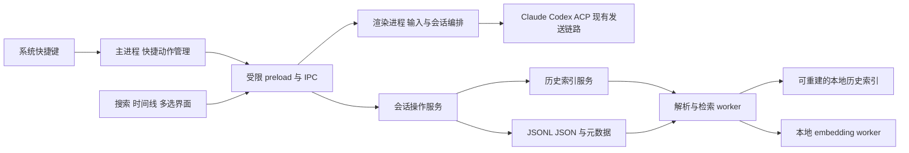
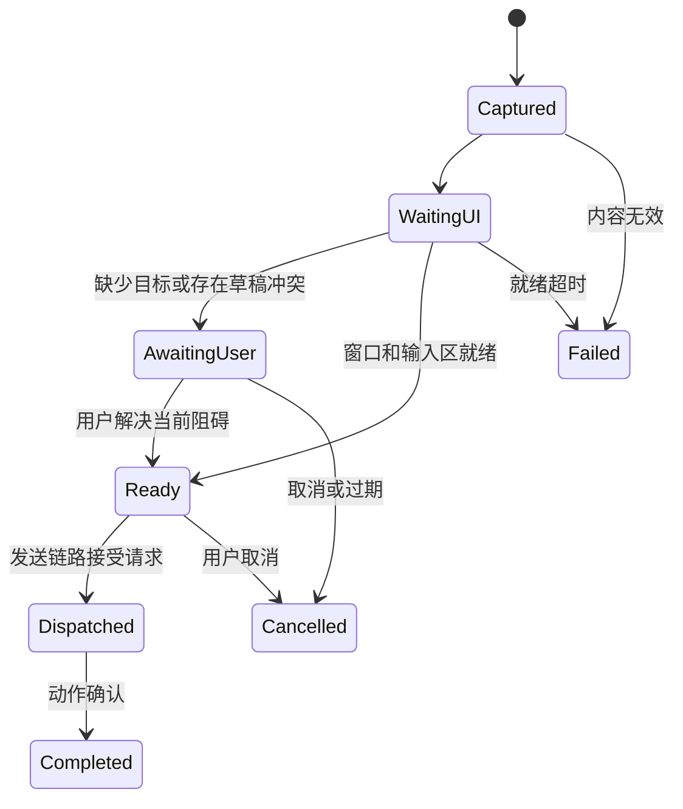

# Harnss 效率提升功能系统分析与设计

## 1 文档信息与设计结论

| 项目 | 内容 |
| --- | --- |
| 版本 | 1.0 |
| 日期 | 2026-10-07 |
| 状态 | 设计基线；文中新增接口、模块和指标均为设计要求，实施进度和验收证据见 [实施记录](implementation-status.md) |
| 需求来源 | 效率提升功能 16 全局快捷键、17 智能搜索、18 批量操作 |
| 代码基线 | 分析起点为 `da92dd8e`；本方案按文中源码入口核对，实施前复核其后并行变更 |
| 适用引擎 | Claude、Codex、ACP；操作 Harnss 管理和保存的会话 |
| 目标读者 | 产品、交互设计、Electron 与 React 开发、测试、发布维护人员 |
| 交付范围 | 行为契约、架构、数据设计、IPC、兼容迁移、异常处理、实施与验收 |

三组功能均可在现有架构内实现。第一批交付全项目关键词搜索、会话与工具结果批量操作、主窗口唤醒和剪贴板分析；后续交付索引、活动时间线、语音快捷输入及语义检索。

会话 JSONL 继续作为事实来源。搜索和时间线共用可删除、可重建的派生索引，避免为搜索功能同时迁移会话主存储。首版快捷输入复用主窗口与现有发送链路；独立悬浮输入窗口不作为依赖。

目录：

1. 文档信息与设计结论
2. 需求范围与验收映射
3. 当前实现与差距
4. 总体架构与一致性约束
5. 全局快捷键与快速输入
6. 智能搜索与语义检索
7. 交互时间线与活动热力图
8. 批量会话操作与工具结果复制
9. 数据模型与持久化
10. IPC 与事件契约
11. 设置与交互集成
12. 性能与数据边界
13. 测试与验收
14. 实施计划与回退
15. 技术验证门槛与设计决策
16. 参考资料

## 2 需求范围与验收映射

### 2.1 功能需求

| 编号 | 用户目标 | 本方案定义 | 交付阶段 | 验收组 |
| --- | --- | --- | --- | --- |
| F16-01 | 在其他应用中唤醒 Harnss | 系统快捷键恢复、显示并聚焦主窗口；默认组合为 CommandOrControl+Shift+Space | M1 | A16 |
| F16-02 | 唤起后直接打字 | 聚焦当前活动窗格的输入区；无会话时准备草稿 | M1 | A16 |
| F16-03 | 唤起后直接说话 | 独立语音动作，在目标输入区就绪后调用原生听写或 Whisper | M5 | A16 |
| F16-04 | 复制内容后自动发给 agent 分析 | 独立剪贴板动作，读取一次纯文本，在明确目标的快速会话中自动发送 | M1 | A16 |
| F17-01 | 一次搜索所有项目历史 | 当前项目、当前 Space、全部项目三种范围；跨 Space 定位原消息 | M2 | A17 |
| F17-02 | 不依赖精确关键词 | 本地向量与关键词混合排序，展示原文命中与来源 | M6 | A17 |
| F17-03 | 按时间查看所有 agent 交互 | 每日提问热力图、日期明细及按时间排列的持久化交互记录 | M4 | A17 |
| F18-01 | 多选会话并归档 | 批量设置归档标记，逐项反馈；不停止运行中的会话 | M3 | A18 |
| F18-02 | 多选会话并删除 | 停止运行、阻止迟到保存、删除关联快照、清理索引和 UI 状态 | M3 | A18 |
| F18-03 | 多选会话并导出 | 一次选目录，各会话导出独立 Markdown 文件 | M3 | A18 |
| F18-04 | 多选工具结果并复制 | 按原始执行顺序复制已完成工具结果及必要上下文为 Markdown | M3 | A18 |

### 2.2 基线产品决策

以下为本版设计采用的默认行为；调整时同步修改对应接口与验收用例。

- 全局快捷键默认关闭，设置页提供一键启用及默认唤醒组合；启用界面说明后台驻留行为。语音和剪贴板动作默认未绑定，用户配置后生效。
- 普通唤醒保留当前会话、窗格及输入草稿。剪贴板分析创建新会话，目标使用最近有效的快捷输入项目与 agent；首次使用或目标失效时在主窗口选择目标。
- 有效目标下，剪贴板动作直接发送，不再追加逐次确认。空内容、超限、认证缺失、目标失效和未发送草稿冲突进入可见的待处理状态。
- 全局搜索默认保持当前 Space 范围；用户可以切到全部项目。历史搜索默认包括归档会话，结果标注归档状态。
- 时间线首版覆盖 Harnss 已保存的顶层用户、助手、工具和系统交互；嵌套子 agent 工具步骤作为父项详情。热力图按已发送用户消息计数。
- 删除为永久删除，一次展示批量确认；归档和复制不增加确认。批量导出通过原生目录选择完成。
- 语义搜索默认关闭，启用后下载并在本地运行 embedding 模型；首版不把完整历史上传云端做向量化。

### 2.3 范围限制

| 场景 | 处理 |
| --- | --- |
| Harnss 已彻底退出、操作系统锁屏 | 不承诺快捷键唤醒；本方案的系统唤醒以进程仍运行为前提 |
| 开机自动启动 | 不作为第一批依赖；可沿用后续独立的登录项设置 |
| 独立悬浮窗口、跨设备搜索 | 不纳入本轮 |
| 尚未导入 Harnss 的 CLI 原始日志 | 不参与搜索和时间线；沿用现有导入入口 |
| 全局持续监听麦克风或剪贴板 | 不实现；只在显式动作触发时访问 |
| 剪贴板图片、文件和富文本专用分析 | 首版只取纯文本；无纯文本表示时提示不支持 |
| 历史子 agent 每一步的精确时间、历史音频 | 不推算；精确步骤时间需要后续新增采集 |
| 搜索直接生成汇总答案、自动执行命中内容 | 不实现；本轮输出可定位的历史结果 |
| 会话主存储整体迁移到 SQLite | 保持既有性能计划的独立评估，不随本功能自动启动 |

## 3 当前实现与差距

以下为现有能力，不代表本方案新增功能已经实现。源码链接以函数名和文件为锚点，避免依赖易变化的行号。

| 领域 | 已有实现 | 本轮差距 | 代码入口 |
| --- | --- | --- | --- |
| 系统快捷键 | 主进程注册 DevTools 快捷键并在退出时注销 | 没有用户唤醒动作、冲突状态和输入路由 | [main.ts](../../electron/src/main.ts) |
| 应用内快捷键 | Shift+Tab、Cmd/Ctrl+F 等依赖窗口键盘事件 | 不能在其他应用前台时触发 | [useKeyboardShortcuts.ts](../../src/hooks/useKeyboardShortcuts.ts) |
| 生命周期 | window-all-closed 停止三类引擎、终端和记忆服务后退出 | 需区分隐藏、窗口关闭、真正退出 | [main.ts](../../electron/src/main.ts) |
| 输入与语音 | contenteditable 输入；原生听写；Whisper tiny.en；首次加载模型 | 缺系统动作桥接；中文模型、准备状态及输入目标绑定需补齐 | [InputBar.tsx](../../src/components/input-bar/InputBar.tsx)、[useSpeechRecognition.ts](../../src/hooks/useSpeechRecognition.ts) |
| 剪贴板 | 已有写文本 IPC 和输入区粘贴 | 缺快捷键触发的读取与发送编排 | [clipboard.ts](../../src/lib/clipboard.ts)、[preload.ts](../../electron/src/preload.ts) |
| 跨会话搜索 | SidebarSearch 调用 sessions:search；传入当前 Space 的项目 ID | 缺全部项目范围、结果分页、相关性排序、显式错误状态 | [AppSidebar.tsx](../../src/components/AppSidebar.tsx)、[SidebarSearch.tsx](../../src/components/SidebarSearch.tsx) |
| 搜索后端 | 遍历项目与最新逻辑会话；标题和 user/assistant 正文做子串匹配；正文最多 10 条 | 缺检索索引和语义召回；旧 JSON 大于 5 MiB 会跳过 | [sessions.ts](../../electron/src/ipc/sessions.ts) |
| 会话存储 | JSONL 优先、旧 JSON 回退；按 message.id 折叠修订；有元数据旁文件 | 索引必须沿用逻辑会话去重和消息覆盖语义 | [session-jsonl.ts](../../electron/src/lib/session-jsonl.ts)、[session-persistence.ts](../../shared/lib/session-persistence.ts) |
| 长期记忆 | Hindsight retain/recall、项目 bank 和共享用户 bank；是否写入受配置与筛选影响 | 不能充当完整消息档案；缺稳定的逐消息检索映射 | [memory/service.ts](../../electron/src/lib/memory/service.ts)、[memory/client.ts](../../electron/src/lib/memory/client.ts) |
| 会话操作 | 单项归档、删除；恢复会话时按稳定身份去重 | 缺多选和逐项结果；删除调用方未检查 IPC 返回的 error | [useSessionCrud.ts](../../src/hooks/session/useSessionCrud.ts) |
| 导出 | 单项保存对话框和 Markdown 序列化；支持工具文本与子步骤 | 批量需要一次选目录、快照一致性和重名处理 | [session-markdown.ts](../../shared/lib/session-markdown.ts)、[SessionItem.tsx](../../src/components/sidebar/SessionItem.tsx) |
| 时间数据 | UIMessage.timestamp；SessionMeta.lastMessageAt 表示最近用户消息时间 | 缺聚合；SubagentToolStep 没有独立时间戳 | [session.ts](../../src/types/session.ts)、[session-persistence.ts](../../shared/lib/session-persistence.ts) |

当前 JSONL 搜索仍通过 readFile 读取整份文件，再调用 parseSessionJsonl；不能因文件按行保存就假定读取是恒定内存流式处理。大文件解析及索引构建应移到 worker，并设置资源边界。

与已有文档的关系：

- [性能优化计划](../performance-optimization/implementation-plan.md) 中 SQLite 与 FTS5 阶段仍有打包验证门槛。本方案只新增派生历史索引，不退役 JSONL。
- [Hindsight 行为契约](../hindsight-memory/behavior-contract.md) 继续约束长期记忆；人工历史检索不会自动改变 memoryMode、memoryIsolated 或向 agent 注入历史。

上述既有计划属于当前工作区参考，部分文件被项目的 docs 忽略规则排除在版本控制之外；关键约束已在本文重述，本方案的实施不依赖这些参考文件随 Git 分发。

## 4 总体架构与一致性约束

### 4.1 职责划分



主进程负责系统能力、路径验证、会话文件和最终操作结果。渲染进程负责用户选择、草稿、焦点与已有引擎编排。worker 承担文件解析、索引查询和向量计算，主进程不执行大规模同步解析或矩阵计算。

### 4.2 必须保持的不变量

1. 所有历史结果都能回到原项目、当前有效会话快照和消息；不得将相似摘要伪装为原文。
2. 会话主数据写入成功不依赖搜索索引成功；索引不可用不阻断聊天。
3. 同一逻辑会话的多个运行时快照只展示一次；同一 message.id 的修订只计数一次。
4. 快捷动作只能进入一个明确的输入目标；重复唤醒不能重复发送、覆盖草稿或切换语音目标。
5. 归档不停止 agent。删除成功后，迟到事件、自动保存和重建索引不能恢复已删会话。
6. 单项与批量操作共享底层行为；批量是逐会话提交，不假装具备跨文件全局事务。
7. 多选状态由稳定 ID 集合保存，折叠、分页和虚拟列表卸载不能改变选择含义。
8. 应用隐藏后保留 renderer 及当前会话编排；真正退出统一执行清理，不能被隐藏逻辑拦截。

### 4.3 最小模块划分

以下路径为计划新增或修改的位置；先按职责实现函数，不预建通用插件、事件总线或多后端框架。

| 位置 | 职责 |
| --- | --- |
| electron/src/lib/global-shortcuts.ts | 注册、冲突检查、配置切换、退出注销 |
| electron/src/lib/quick-capture.ts | 快捷请求队列、一次性剪贴板载荷、动作状态 |
| electron/src/ipc/quick-capture.ts | 受限领取与确认接口 |
| electron/src/lib/session-operations.ts | 单项与批量共用的归档、删除、导出协调 |
| electron/src/lib/history/ | 源数据提取、索引、查询、时间聚合；worker 按需要拆分 |
| electron/src/ipc/history.ts | 搜索、活动查询、索引状态与取消 |
| shared/types/productivity.ts | 新增 IPC 请求、响应、状态类型；由两端共享 |
| src/hooks/app-layout/useQuickCapture.ts | 主窗口就绪、活动窗格、目标解析、发送 |
| src/hooks/session/useSessionSelection.ts | 会话 ID 多选与范围操作 |
| src/components/history/ | 全局搜索结果和活动视图 |
| src/components/sidebar/ 与 ChatView/ToolCall | 批量操作栏、工具结果多选 |
| shared/lib/session-markdown.ts | 提取可复用的工具 Markdown 序列化函数 |

## 5 全局快捷键与快速输入

### 5.1 动作定义

| 动作 | 配置键 | 行为 |
| --- | --- | --- |
| 唤醒并打字 | wake | 恢复主窗口，聚焦原活动窗格输入区；再次按下仍聚焦，不隐藏 |
| 唤醒并听写 | dictate | 完成同样的定位，再启动听写；Whisper 已录音时再次触发停止 |
| 分析剪贴板 | analyzeClipboard | 捕获当前纯文本，准备快速会话并发送固定分析意图 |

macOS 默认唤醒组合为 Cmd+Shift+Space，Windows/Linux 映射为 Ctrl+Shift+Space。注册发生在 app ready 之后。注册失败必须出现在设置页状态中，提供改键入口，不仅写日志。

修改绑定时先验证组合和动作内重复，再尝试注册新组合；失败保留旧组合。动作间交换组合需要回滚策略。重复按键产生的 wake 合并为一次聚焦；一次未完成的语音或剪贴板请求期间，相同动作只聚焦已有请求。

Electron 40 的 Wayland 支持依赖 GlobalShortcutsPortal；需合并已有 enable-features 配置，而非覆盖其他 Chromium 功能开关。桌面环境不支持时说明不支持，保留应用内入口。[依据](https://github.com/electron/electron/blob/v40.4.0/docs/api/global-shortcut.md)

### 5.2 后台驻留与退出

- 启用快捷功能且 keepAliveOnClose 为 true 时，用户关闭主窗口改为 hide，保留主窗口对象、renderer、草稿、引擎和终端。最小化后唤醒需先 restore。
- macOS 保留 Dock 菜单，Windows/Linux 提供托盘入口；均提供“显示 Harnss”和“退出 Harnss”。托盘创建失败时不能把应用隐藏到无法恢复的状态。
- 菜单退出、系统注销和应用重启设置统一的 quitting 标记，随后正常关闭窗口、停止引擎及终端、停止录音和 worker、注销快捷键、关闭索引连接。
- 将现有 window-all-closed 中的资源清理归入统一退出路径，避免 hide 时误清理、真正退出时重复清理。
- 后台驻留不新增空会话或录音。隐藏状态的 CPU、内存增量见第 12 节。
- 增加单实例锁；第二次启动仅激活既有实例，不建立第二套快捷键、索引写者与引擎注册。

### 5.3 输入路由与请求状态



每次动作生成 requestId。主进程只保存一个待处理的非 wake 请求及其载荷，renderer 订阅事件后主动领取当前请求，避免窗口加载期间丢事件。同一未消费请求可以重复领取同一快照，直到发送接受、取消或过期；发送编排另外按 requestId 去重，不能因为 React 重挂载而重新发送。

触发时固定输入目标。等待主窗口可见、renderer 已挂载、目标会话已解析和输入区可编辑，再通过组件 ref 聚焦；不使用全局 querySelector 命中任意输入框。分屏只操作当前活动窗格。

普通唤醒不清空文字、附件或 @ 引用。无会话但有有效项目时创建草稿；无项目时聚焦项目选择。弹出的删除确认或原生文件对话框未关闭时等待，不能绕过该交互。

就绪等待上限暂定 5 秒，超时提示重试。等待用户处理的剪贴板载荷最多在内存保留 5 分钟；取消、过期或退出立即释放。重启不重放；发送已被接受但确认丢失时显示结果待核实，不自动再发一次。

### 5.4 剪贴板自动分析

1. 主进程在快捷键回调中调用 clipboard.readText，捕获该时刻的内容及请求 ID；之后不再自动读取新内容。
2. 纯空白或不支持的格式直接提示，不调用 agent。首版自动发送上限为 UTF-8 编码 64 KiB，超过则展示原因与内容预览，要求用户缩减后重试；不静默截断。
3. 验证最近快捷输入项目和 agent。项目已删除、agent 未安装或未认证时进入 AwaitingUser，处理完成前不发送。
4. 为本次分析创建新会话，沿用目标项目现有模型与权限设置。若当前有未发送草稿，暂停自动动作，保留原草稿并提示先处理或取消；不得直接调用会丢弃草稿的创建流程。
5. 将固定分析意图与“剪贴板引用内容”组合，进入已有创建与发送链路。内容以 / 开头也不得被解释为 Harnss 斜杠命令；剪贴板文本是分析材料。
6. 发送成功后显示目标项目和会话。创建失败可保留同一请求重试；已经送达的请求不以新的 requestId 自动重试。

不新增面向任意 renderer 的通用剪贴板读取 IPC。主进程只把本次请求载荷交给经过身份校验的主应用 renderer。现有 agent 工具权限和审批行为继续生效。[剪贴板接口依据](https://github.com/electron/electron/blob/v40.4.0/docs/api/clipboard.md)

### 5.5 语音快速输入

原生模式复用 macOS startDictation，必须先确认目标 contenteditable 获得焦点。当前 hook 的短暂 isListening 状态只是触发反馈，不能当作系统麦克风实际录音状态；UI 使用“已请求系统听写”。Windows/Linux 原生模式继续给出系统听写入口或选择 Whisper。

Whisper 动作状态为 idle、preparing、recording、transcribing、error。首次下载显示进度，模型和权限就绪后才展示录音开始；不得提示用户已经录音却丢弃其开头讲话。中文支持需选用多语种模型并通过 A16 测试。

录音开始后绑定会话与输入目标，转写不得插入后来切换到的会话。切换项目、关闭窗格或取消动作时停止录音；已经生成的文字保留在原目标，已销毁目标则显示可复制的转写结果。原生听写无法可靠控制结束的部分由系统 UI 承担，不显示虚假的应用级停止状态。

语音转写默认填入输入区，由用户发送；本需求中的自动发送仅适用于明确触发的剪贴板分析。

## 6 智能搜索与语义检索

### 6.1 查询范围与展示

搜索入口继续位于侧边栏，展开后提供独立结果视图。保留会话内 Cmd/Ctrl+F 的行为，不把会话内搜索替换为全局搜索。

| 项目 | 规则 |
| --- | --- |
| 范围 | 当前项目、当前 Space、全部项目；全部项目跨 Space |
| 内容 | 会话标题、用户可见正文、助手正文；首版不索引 thinking、隐藏记忆注入和附件二进制 |
| 条件 | 项目、引擎、日期范围、是否包含归档；条件之间为 AND |
| 模式 | keyword、semantic、hybrid；语义未启用时仅 keyword 可选 |
| 排序 | 关键词支持最新优先与相关性；语义和混合采用相关性 |
| 查询长度 | 去除首尾空白后 1 至 512 个 Unicode 字符；空查询显示入口说明 |
| 输入响应 | 300 ms 防抖；输入法组合输入期间不提交查询 |
| 分页 | 默认每页 30 条，接口最多 100 条；不再使用固定 10 条正文上限 |
| 结果字段 | 原文片段、项目、Space、会话、引擎、时间、归档标记及匹配来源 |
| 跳转 | 校验来源仍存在，切 Space/项目，加载当前会话快照，再定位 messageId |

用户正文优先使用 displayContent；缺失时沿用现有可见文本提取逻辑，避免将附加文件 XML、记忆注入或内部提示当作用户输入展示。工具输出的批量复制不依赖将所有工具输出加入搜索索引。

每次查询都有 requestId。renderer 只接受当前请求结果，范围或查询改变立即取消旧请求。服务端取消是在文件、会话或推理批次边界停止工作；迟到响应不能覆盖新查询。

已归档结果可以打开，但打开不自动取消归档。会话已删除或原消息在回退后不再存在时，返回 SOURCE_GONE，提示刷新；不悄悄跳到另一条消息。

### 6.2 两阶段关键词后端

M2 先扩展现有文件扫描路径，修正范围、全局排序、分页和错误展示。以统一提取函数读取最新逻辑会话，兼容 JSON/JSONL，不再静默跳过大于 5 MiB 的旧 JSON。大文件读取受 worker 内存预算约束，无法处理的会话计入 coverage.skipped 并提示。

M4 引入 SQLite FTS5 派生索引。默认候选是 better-sqlite3，与既有性能计划一致；实际版本必须通过 G1 的 Electron 40、worker 和安装包验证后固定。索引文件丢失或初始化失败时退回文件扫描，不阻断查询入口。

关键词语义以用户输入的字面文本为准，不把输入直接拼接为 SQL 或 FTS 表达式。默认使用归一化检索副本，原文始终单独保留；归一化会改变长度时，片段在原文上重新定位，不能直接套用归一化字符串偏移。

使用 trigram 索引支持中英文子串查询；少于三个 Unicode 字符的查询进入参数化的字面匹配路径，允许更慢并可取消。不能把两字中文查询的空结果当成“没有历史”。FTS detail 保持支持所用查询形式的配置，通过短语、引号、百分号、下划线和文件路径用例验证。[FTS5 依据](https://www.sqlite.org/fts5.html#the_trigram_tokenizer)

排序规则：

1. 最新优先按消息时间降序、稳定 entryKey 升序；标题命中使用会话创建时间作为自身时间，不混作消息时间。
2. 关键词相关性先区分标题完全匹配、标题子串和正文命中，再以检索排名及时间打破并列。
3. 每个消息只保留一个结果，标题命中作为独立会话结果；同一会话允许多条不同消息命中。
4. 游标绑定查询条件、排序与索引 generation。翻页时 generation 不匹配返回 CURSOR_EXPIRED，保留当前页并提供刷新；不拼接不同代的结果。文件扫描模式使用本轮来源快照标识实现同样契约。

全量关键词结果可继续翻页。取消、读取失败和空结果必须是不同状态；不沿用 catch 后返回空数组的表现。

### 6.3 语义索引与混合召回

语义检索按原始可见消息分块，不要求先让 LLM 摘要每条会话。摘要容易丢失错误码、具体决策和来源位置，也不能覆盖过去未启用记忆的历史。

处理流程：

1. 按段落及代码块边界分块，超长块再按模型 tokenizer 切分。目标 384 tokens、重叠 64 tokens，必须给模型前缀和特殊 token 留出空间；实际值在 G2 固定。
2. 每块保存 entryKey、chunkIndex、原文起止位置、contentHash、模型版本。只有内容或模型签名改变才重新向量化。
3. 用户查询用同一模型和查询输入规范编码。段落输入与查询输入是否需要不同前缀，由所选模型清单明确。查询超过模型 token 上限时，纯语义返回 QUERY_TOO_LONG；混合模式明确退回关键词，不静默截断。
4. 先应用项目、引擎、归档和日期过滤，再分别取得关键词与向量候选，避免范围外结果挤占名额。
5. 初始每路取前 100 个候选，使用倒数排名融合：某候选在一路排名为 r 时贡献 1 / (60 + r)，两路求和；不直接相加不可比的原始分数。
6. 按 entryKey 合并重叠分块，取最相关片段；仅单路命中仍可入选。返回匹配方式，不将相似度包装成“答案置信度”。

上述双路召回与融合适用于 hybrid；semantic 只使用向量候选，keyword 只使用全文路径。语义和混合结果属于候选检索，默认返回去重后最多 200 条的排名窗口；响应明确标注 rankingWindow 和候选范围，不将其宣传为全库穷尽匹配。关键词模式保持完整分页能力。

默认架构为小型多语种 ONNX embedding、本地推理、SQLite 保存向量。首版在 worker 内做余弦相似度排序，按范围过滤后分批加载向量；先验证 10 万分块规模，再判断是否引入 ANN。不在技术验证之前加入第二套向量数据库或远端服务。

模型具体 ID、不可变 revision、tokenizer、量化格式、维度和分发许可证由 G2 固定。现有 Whisper 的 CDN 动态加载不等于已有可复用的生产级 embedding 运行时；embedding 依赖、模型缓存和 worker 打包需单独验证。

### 6.4 Hindsight 复用边界

可复用 Hindsight 接入中已有的设置展示、下载进度及运行状态处理经验。完整历史检索使用独立的源消息映射与索引，不向共享用户 bank 回填整段历史。

现有自动记忆受 enabled、autoRetain、项目 memoryMode 和内容长度约束；记忆还可能经过抽取、改写与去敏。共享用户 bank 的 tags 不保证包含原 sessionId。因此 recall 不能证明“已搜索全部历史”，也不能保证定位原消息。

人工选择“全部项目”不会改变 agent 的 memoryIsolated 规则。搜索结果不会自动注入 agent；用户后续明确选择引用结果时才进入另一个发送流程。

### 6.5 索引更新与异常恢复

| 事件 | 源数据处理 | 索引处理 |
| --- | --- | --- |
| 首次建索引 | 只读枚举已保存会话 | 分批回填；展示完成数、失败数和覆盖状态 |
| save/append 成功 | 已完成源文件与元数据提交 | 合并同逻辑会话待办，提取最新快照并 upsert |
| 同 ID 消息修订 | 保持原消息位置、最后内容有效 | 替换对应 entry 与 chunks，不增加活动计数 |
| 回退、重试截断、全量覆盖 | 以新的完整消息集合为准 | 差集删除旧 entry/chunks，不能只追加 |
| 会话运行时 ID 变化 | 更新当前快照映射 | 稳定 conversationKey 不变，更新 runtimeSessionId |
| 归档、改名、移动项目所属 Space | 提交元数据 | 更新过滤与展示字段，正文未变不重新 embedding |
| 删除会话或项目 | 生效删除屏障并清理源数据 | 立即排除结果、清理全文/向量/活动派生记录 |
| 索引损坏或版本变化 | 不改变会话文件 | 后台重建，关键词可退回文件扫描 |
| 磁盘满或模型不可用 | 聊天继续按原有存储错误规则工作 | 暂停索引，标明覆盖不完整，允许重试 |

索引更新在源数据提交后触发，失败只影响索引。通知丢失通过启动时清单对账修复：比对当前快照、版本、消息内容签名和删除记录。应用激活时可节流检查元数据变更；完整重建始终可手动触发。

每个索引任务携带 conversationKey 和来源版本。读取前后若文件或快照版本变化，丢弃旧提取结果并重排最新任务；删除代数改变后，不允许较早任务重新写回结果。校验与最终发布在索引串行提交点完成。

重建写入新的 generation，完成来源对账后再发布；发布前再次合并期间发生的更新与删除。取消重建保留旧代，若旧代也不完整则明确显示覆盖状态。任何代都必须过滤已经生效的删除屏障。

## 7 交互时间线与活动热力图

### 7.1 展示结构

活动视图包含最近一年日历热力图、日期选择和交互列表。热力图默认展示“已发送提问数”，颜色深浅仅表示数量；每个日期有可读日期、数量和键盘焦点，不依赖颜色传达信息。

点击日期后列出该日交互，支持项目、Space、引擎与归档条件，条件语义与搜索一致。列表按时间倒序，每页 50 条，展示时间、项目、会话和交互类型，点击定位原消息。长列表使用现有虚拟列表模式。

### 7.2 计数与时间契约

| 对象 | 时间线 | 热力图计数 |
| --- | --- | --- |
| 已发送 user 消息 | 展示原文摘要 | 每个稳定 messageId 计 1 次 |
| isQueued 用户消息 | 不作为已发生交互展示 | 不计数 |
| assistant 消息 | 展示保存时的消息内容 | 不增加提问数 |
| 顶层 tool_call | 展示调用记录和状态，详情读取结果 | 不增加提问数 |
| 独立 tool_result | 与对应工具调用合并，避免重复显示 | 不计数 |
| system、summary | 作为对应类型交互展示 | 不计数 |
| 嵌套子 agent 步骤 | 随父工具展开，保留原顺序 | 不单独计数 |

时间存储采用 UTC epoch milliseconds，按当前设备 IANA 时区分组和显示。用户改变时区后重算日聚合，不修改原时间戳。日期范围以本地日边界转换为半开 UTC 区间，覆盖夏令时导致的 23/25 小时日期。

顶层工具的现有 timestamp 只表示已记录的消息时间，不推断执行完成时间或精确耗时。缺少有效 timestamp 的旧消息进入“时间未知”列表；若仅能展示会话创建时间，标注“会话时间”，不计入按日热力图。

活动计数来自规范化后的消息集合，不能按 JSONL 行数或 lastMessageAt 推算。会话恢复、索引重建、工具结果回填均不得增加重复活动；删除与回退应减少相应计数。

### 7.3 历史回填与实时性

先加载日期与数量，再按需读取当天条目，不把一年所有会话正文传入 renderer。首版可直接按已建立的 entries 索引聚合，不另建一套写入事件库。

索引尚未完成时显示“已覆盖 X 个会话，仍在处理 Y 个”，已覆盖数据可查看；不能把不完整计数显示为完整全年活动。已保存数据更新后，目标在 5 秒内刷新活动视图，实际刷新仍受索引状态和源保存时机约束。

## 8 批量会话操作与工具结果复制

### 8.1 会话选择

侧边栏进入选择模式后显示复选框和固定操作栏。单击勾选，Shift 按当前可见排序连续选择；折叠或虚拟列表卸载保留已经选中的 ID。普通导航与多选模式分开，避免点选即切换聊天。

选择键使用 projectId 与 conversationKey，执行时解析当前 runtimeSessionId。一次操作冻结目标集合，后续新建会话不自动加入。首版最多选择 500 个逻辑会话；“全选”只选择当前已加载列表，文案显示范围和数量，不暗示全库选择。

切换选择列表的项目或 Space 范围时退出选择模式；同一范围内折叠、排序和翻页保留集合。快捷唤醒期间不执行悬空的批量动作。成功项目移出选择，失败项目保留以便重试。

### 8.2 批量任务与部分失败

任务状态为 preparing、running、completed、partially_failed、failed、cancelled。每项状态为 pending、running、succeeded、failed、skipped、cancelled。返回逐项结果和已完成数量；进度按项目完成数计算，不伪装成文件字节进度。

主进程创建 jobId，以客户端 requestId 去重；同一进程中重试相同 requestId 返回同一任务。不同操作不能同时修改同一逻辑会话，冲突返回 BUSY。默认最多并发处理 3 个会话，单会话写入仍严格串行。

取消只阻止尚未开始的项目，正在进行的单会话操作执行到安全边界；已归档、已删除或已导出的项目不回滚。renderer 重新订阅后通过状态查询补齐遗漏事件，不因订阅顺序丢失最终结果。

### 8.3 归档

归档只修改 archived，运行中的 agent、消息队列和已有打开窗格继续工作；侧边栏隐藏后仍可在归档视图或历史搜索找到。归档后的后台保存不能把标记清掉。

写入服务必须把归档、置顶、目录和分支等元数据按其权威来源合并：save/append 未携带的字段保留，update-meta 中显式 null 表示清除。相关提交按逻辑会话串行，解决整份快照与元数据补丁互相覆盖的问题。

归档失败按单项恢复 UI；不要为每一项弹一条 toast。任务结束给出汇总和失败明细。相同目标再次归档返回 skipped/already_applied，便于安全重试。

### 8.4 删除与并发保存

确认对话框显示会话数、运行中会话数和永久删除范围。用户确认一次后执行；不为每个会话重复确认。

删除流程：

1. 在 renderer 将目标标记为 deleting，停止该会话新的发送及自动重试，取消尚未触发的自动保存和排队消息；包含分屏和后台会话。
2. 主进程解析同一 conversationKey 的所有历史和当前运行时快照，持久化删除意图并建立写入屏障。对该逻辑会话的 save、append、update-meta 和运行时替换都必须检查屏障。
3. 停止对应 Claude/Codex/ACP 运行时及属于该会话的子任务，清理待处理权限请求。主进程验证实际停止状态，不能仅相信 renderer 声称已停止。
4. 等待已进入写队列的任务到达串行边界，删除该逻辑会话的 JSONL、旧 JSON、meta 及索引记录。
5. 文件处理成功后把删除记录改为 committed，移除活动/后台缓存、持久化游标、通知和分屏引用，再确认成功。

恢复与重启请求须携带原项目和已保存的运行时 ID，由主进程读取源元数据确认逻辑身份及引擎。在 SDK 加载、二进制查找或协议初始化之前登记新运行时，即使新快照尚未写入，删除也能找到它。删除先取消所有登记，再等待已创建进程退出；异步准备完成后、返回恢复结果前以及记忆预检后的发送前必须复核状态。尚未启动的登记也写入删除记录的运行时列表，阻止重启后的迟到保存。停止失败可撤销删除意图，但不能重新激活已取消的恢复流程。

现有 SessionWriteQueue 按运行时文件键串行，不能独自解决恢复后多个 ID 的竞态。新增服务在逻辑会话层建立顺序，再调用原文件队列；固定顺序为逻辑会话锁后文件队列，批量任务不同时持有多个会话锁。

删除记录位于源数据目录独立子目录，包含逻辑身份、快照 ID、操作 ID 与阶段，不包含消息内容。它属于删除正确性数据，不能与可重建索引一起清除。迟到写入在真正执行前再次检查记录；启动先恢复未完成删除，再枚举可见会话。

停止失败且尚未删文件时，撤销本次意图并报告失败；如已删部分文件，则保留 deleting 屏障并报告“删除未完成，可重试”，不能重新展示较旧快照作为成功恢复。删除已经 committed 的目标返回 skipped/already_deleted。

启动恢复逐条处理有效删除记录。一项清理失败只保留该会话的屏障，其他会话仍可加载和保存；界面从未完成删除记录恢复失败任务，并提供“重试失败项”。重试按持久化逻辑身份继续，即使原快照已全部移除也可完成最后提交。损坏或身份不一致的删除记录明确返回 DELETION_STATE_INVALID，不将其误当成未删除；记录修复后可以重新读取。

删除 IPC 的 error 必须在调用方检查。会话删除清理 Harnss 保存的历史及派生索引，不声称已经删除各引擎自行保存的 CLI 历史或独立 Hindsight 长期记忆；删除确认文案清楚说明范围。

整个项目删除沿用相同约束，删除范围是 Harnss 中的项目记录和该项目的会话历史，保留磁盘上的工作目录。项目屏障位于 `sessions/.project-deletions/{projectId}.json`，记录 version、projectId、pending/committed、unlinkStarted 和 updatedAt；屏障覆盖项目下未知的新运行时 ID。三引擎首次启动也必须按项目登记尚未保存的草稿，不能只登记恢复后的会话。持久化意图后等待已进入的写任务，取消登记并确认进程退出，再清理源目录、提交删除状态和原子更新项目目录表。项目屏障生效时立即失效搜索、时间线和活动查询；索引发布也读取持久项目屏障，不依赖 renderer 的项目列表已经刷新。

项目停止失败且未清理文件时可以撤销意图；部分目录清理或最后提交失败保留项目行供用户重试。源数据已提交删除但项目目录表更新失败时，重试只完成目录表清理，不重复启动或停止进程。启动恢复逐项目处理，单项失败保留屏障但不阻止其他项目；前端仅在后端确认成功后移除项目并清理其聊天、队列、缓存、权限提示和窗格。

### 8.5 导出

批量导出只弹一次原生目录选择。选择目录后，由会话管理器先 flush 所选活动、后台和分屏会话的当前可保存内容，排除尚未发送消息；失败项目返回 SNAPSHOT_FAILED，不静默导出旧内容。

主进程在每个会话自己的串行边界读取快照，再释放边界并序列化。不同会话不要求同一毫秒的全局快照；单个文件内容必须自洽。运行中会话导出当前已保存进度，标注快照时间及“执行尚未结束”，不能表示完整终稿。

复用 buildSessionMarkdown。文件名采用清理后的标题、逻辑身份短哈希与导出时间，重名时增加序号；使用排他创建/临时文件提交，不能覆盖同名文件。路径只能由主进程认可的原生目录选择结果派生，去除路径分隔符和平台保留名称。

一个会话生成一个 .md 文件，保留工具文本、代码围栏和已支持的子步骤。大文本分批处理，单项失败不影响已完成文件。图片或二进制附件不能悄悄变成 base64 大段文本，明确保留可用引用或说明附件未内嵌。

取消导出保留已完成文件，清理本任务未完成的临时文件。目录选择取消属于 cancelled，不显示错误。

### 8.6 工具结果批量复制

从顶层工具卡片进入多选，以 session 身份和 message.id 保存选择；工具组的全选操作展开为真实子卡片 ID。首版不增加嵌套子步骤独立选择，选中父工具时包含其已完成子步骤。

结果从 UIMessage.toolResult 读取，独立 tool_result 不作为第二份结果。折叠、虚拟渲染和只显示部分 stdout 都不能截短实际复制内容。

序列化顺序采用会话原始消息顺序，包含工具名、输入参数、输出与错误状态；只有有效时间才写时间。复用共享 Markdown 工具函数的文本提取及动态代码围栏规则，保留错误输出。

运行中且没有完整结果的卡片不可选。点击复制时冻结所选消息快照，过滤已被回退或删除的项并提示数量；有错误的已完成工具仍可复制。单次文本上限暂定 5 MiB，超限提示减少选择或导出会话，不静默截断。

调用既有 copyToClipboard，成功才显示“已复制 N 项”。失败保留选择与重试入口。复制结束不修改会话或工具状态；切换会话清空该复制选择，防止跨会话意外混合。

## 9 数据模型与持久化

### 9.1 身份与引用

沿用 sessions.ts 中 conversationKey 的优先级：

- engine 缺省为 claude。
- Codex 存在 codexThreadId 时优先使用它。
- 其他情况使用 conversationId，缺省回退当前 id。
- 将 projectId、engine 和上述身份组成有明确边界的元组，序列化后生成稳定键；不能直接用不转义的字符串拼接。

逻辑键用于去重、操作锁与索引，runtimeSessionId 只用于定位当前存储和运行时。不同项目、不同引擎中的同名 ID 不合并。消息引用为 conversationKey 与 messageId；标题引用不伪造 messageId。

提取此规则为两端需要时可共用的纯函数；历史快照排序继续遵循最新用户活动、相同时按保存时间选择的现有规则。迁移或恢复改变逻辑身份时显式重映射旧索引，不能留下双份命中。

跨运行时替换由主进程持久记录旧、新 runtimeSessionId 及逻辑键。先写 prepared 记录，完整写入新 JSONL 与 meta 后，再原子提交 committed 记录；提交前原快照仍为有效来源，新快照不进入列表或索引。提交失败清理新快照并保留原快照；清理失败保留 prepared 记录，启动时继续回滚。提交后旧 ID 的普通 save、append、update-meta 和重新启动均不得重建旧来源，应用重启后同样有效。

替换同时占用旧、新逻辑键及运行时 ID 的写队列，避免不同逻辑身份绕过并发删除。删除可从显式替换链中的旧 ID 解析当前来源，并覆盖链中的所有运行时及已登记进程。新进程已经接管后，原来源 ID 的退休不能使新进程的登记失效；旧进程仍不能发送或保存。提交后的旧文件清理失败单独报告并在启动时重试，不能把已经提交的替换当作保存失败。

替换时同时记录并停用已经存在的同一逻辑会话快照。新来源因回退而具有较早时间戳时，也不能让遗留快照重新成为有效历史。普通写入除声明的逻辑键外，还须使用磁盘上原身份进入队列，防止遗留别名改报逻辑身份后绕过正在提交的替换。

运行时 ID 不变但逻辑身份变化时，先备份该来源现有的 JSON、JSONL 与 meta，再使用同一 prepared/committed 提交流程。prepared 阶段，列表、加载和历史提取读取备份；回滚恢复原有文件格式并移除该事务新建的格式。新身份提交后，当前进程登记继续有效，携带旧逻辑身份的保存被拒绝。删除来源或项目时，备份也属于待删除源数据；删除屏障必须先于启动回滚生效，备份清理失败使删除保持未完成状态。没有 prepared 记录的备份目录可在启动时清理，不能由历史缓存清理流程删除有效备份。

### 9.2 文件布局

数据根目录继续使用 getDataDir，也就是 app userData 下的 openacpui-data。

| 位置 | 性质 | 内容 |
| --- | --- | --- |
| sessions/{projectId}/{runtimeSessionId}.jsonl | 事实来源 | 完整快照或增量行 |
| sessions/{projectId}/{runtimeSessionId}.meta.json | 现有元数据 | 标题、身份、排序及归档等信息 |
| sessions/{projectId}/{runtimeSessionId}.json | 兼容读取 | 尚未迁移的旧快照 |
| sessions/.deletions/{conversationKeyHash}.json | 删除正确性数据 | pending/committed、快照 ID、操作 ID、更新时间 |
| sessions/.project-deletions/{projectId}.json | 项目删除正确性数据 | 项目屏障、清理及提交状态；覆盖未保存草稿 |
| sessions/.replacements/{replacementHash}.json | 替换正确性数据 | prepared/committed、旧新运行时与逻辑身份、退休快照 ID 和备份格式；跨运行时沿用项目与目标 ID 哈希，同 ID 变更额外包含旧新逻辑键 |
| sessions/.replacements/{replacementHash}.json.backup/ | 同 ID 替换的原来源备份 | prepared 阶段供读取及回滚使用；提交或回滚完成后清理；删除也须清理 |
| history/index-v1.sqlite | 可重建缓存 | 元数据、可见文本、FTS、分块、向量 |
| history/index-v1.building.sqlite | 可丢弃临时数据 | 重建中的下一代，包含自身 generation |
| models/embeddings/{modelKey}/ | 可重新下载的模型缓存 | 模型、tokenizer、校验清单 |
| settings.json | 配置 | 全局快捷键、后台驻留、快捷输入目标、语义开关 |

一个历史索引服务本地全部项目，通过 projectId 等字段过滤。该索引不是跨账号服务，Space 也不作为新的权限租户边界。项目删除时执行过滤失效和数据清理，不能等到下一次全量重建。

现有会话文件位置和读取格式不变。索引结构变化增加 schemaVersion 并重建；未知版本不能直接尝试写入。删除及替换记录结构需向后兼容，清理历史索引不得清理这些正确性记录。

### 9.3 索引逻辑表

| 表 | 键与主要字段 | 约束 |
| --- | --- | --- |
| index_meta | schemaVersion、generation、extractorVersion、state、updatedAt | 版本不匹配重建；发布状态与覆盖率一致 |
| conversations | conversationKey、projectId、spaceId、engine、agentId、runtimeSessionId、title、archived、createdAt、sourceRevision | conversationKey 唯一；agentId 可为 null |
| entries | entryKey、conversationKey、messageId、kind、sourceOrder、timestamp、timestampQuality、displayText、searchText、contentHash、isComplete | 标题 messageId 为 null；其他项由源 message.id 定位 |
| entries_fts | rowid、searchText | 与可搜索 entries 在同一索引事务内更新 |
| chunks | chunkKey、entryKey、chunkIndex、startOffset、endOffset、contentHash | entryKey 与 chunkIndex 唯一；偏移注明基于原文 UTF-16 code units |
| embeddings | chunkKey、modelKey、dimension、vector、contentHash | chunkKey 与 modelKey 唯一；向量长度、版本和内容哈希一致 |
| index_progress | conversationKey、sourceRevision、status、errorCode、updatedAt | 记录排队、已完成和失败，支持来源对账 |

entries.kind 区分 title、user、assistant、tool、system、summary。只有 title/user/assistant 进入首版全文和向量检索；其他类型服务于时间线，正文可以按需从源会话读取。独立 tool_result 归并到相应工具项。

timestampQuality 使用 exact、session_time、unknown。只有符合计数条件的 exact 用户消息参与热力图；timestamp 不可靠时为 null，不写入当前时间补空。

sourceRevision 表示规范化后快照的内容与相关元数据版本；后台计算签名，不在主进程对大消息数组反复 stringify。contentHash 用于分块缓存，不能把哈希相同的不同会话来源合并掉。

FTS、entries 和 chunks 更新以单逻辑会话为事务范围。embedding 可稍后补齐，检索响应分别报告 keywordCoverage 与 semanticCoverage，不把“全文已建完”误报为“向量已建完”。

### 9.4 源数据与缓存的事务边界

| 边界 | 保证 | 失败结果 |
| --- | --- | --- |
| 单会话源保存 | 沿用原子文件写及队列；提交后才通知索引 | 保存失败按现有错误链路报告 |
| 运行时或逻辑身份替换 | 来源完整写入后提交替换记录；旧、新身份共同串行 | 跨 ID 未提交时删除新快照，同 ID 未提交时恢复备份；已提交时拒绝退休 ID / 旧身份并重试清理 |
| 元数据合并 | 逻辑会话串行，缺省字段保留、显式 null 清除 | 对该项回滚 UI，不影响其他会话 |
| 单会话索引更新 | 新 entries/FTS/chunks 同时生效 | 回滚该次索引事务，保留旧版本并标记待同步 |
| 向量更新 | modelKey 与 contentHash 匹配才可发布 | 丢弃过期结果，重新排队 |
| 删除 | 持久删除意图先于不可逆文件清理 | 重启可重试；迟到写入被拒绝 |
| 项目删除 | 项目屏障覆盖未保存草稿和新运行时；会话源删除提交后再移除项目行 | 项目行保留为重试入口；其他项目不回滚 |
| 批量操作 | 各会话独立提交 | 返回逐项结果，不撤销已成功项 |
| 导出 | 每个 Markdown 文件完整提交 | 清理本任务临时文件，保留已完成文件 |

## 10 IPC 与事件契约

### 10.1 通用规则

新增类型集中在 shared/types/productivity.ts，preload 与 window.d.ts 引用同一类型。旧 sessions:search 保持旧响应形状作为兼容包装，新历史界面调用新接口；单会话入口逐步改为共享操作服务，不复制第二套删除逻辑。

请求仅接受主应用 renderer，拒绝 webview、任意子 frame 和外部网页。主进程验证项目属于当前已知项目集合、逻辑会话属于项目、请求数量及文本长度，并通过 data-dir 构造路径；不接受任意文件路径代替会话身份。

新增接口返回判别联合，不能把失败伪装为成功空数组：

```ts
type OperationResult<T> =
  | { ok: true; value: T }
  | {
      ok: false;
      error: { code: string; message: string; retryable: boolean };
    };

type HistoryScope =
  | { kind: "all" }
  | { kind: "space"; spaceId: string }
  | { kind: "projects"; projectIds: string[] };

interface ConversationRef {
  projectId: string;
  conversationKey: string;
}

interface HistorySearchRequest {
  requestId: string;
  query: string;
  scope: HistoryScope;
  mode: "keyword" | "semantic" | "hybrid";
  sort: "recent" | "relevance";
  engines: Array<"claude" | "acp" | "codex">;
  from: number | null;
  to: number | null;
  includeArchived: boolean;
  limit: number;
  cursor: string | null;
}
```

空 engines 表示全部引擎，from/to 为 UTC 毫秒、半开区间，null 表示无该边界。scope.projects 的空数组非法；未知项目不能默认为全部项目。cursor 为服务端生成的不透明值，客户端不得自行拼接。

### 10.2 接口清单

| 通道 | 方向与请求 | 成功响应或事件 | 主要约束 |
| --- | --- | --- | --- |
| shortcuts:get-status | renderer → main，无参数 | 各动作的配置、有效绑定、注册状态、平台支持情况 | 状态描述实际注册结果 |
| settings:set | 沿用现有接口，增加快捷与语义配置块 | 原有设置写入结果 | 快捷键变更走可回滚注册流程 |
| quick-capture:pending | renderer → main，无参数 | 当前待处理请求或 null | 只向主 renderer 返回未消费请求的同一快照 |
| quick-capture:update | requestId、目标、合法状态转换或错误 | 请求当前状态 | 校验前置状态；已发送请求不能返回可重发状态 |
| quick-capture:requested | main → renderer | requestId、action、createdAt | 事件不携带剪贴板正文，正文经 pending 领取 |
| history:search | HistorySearchRequest | 结果、游标、coverage、实际后端和模式 | requestId 回传；模式降级明确标注 |
| history:cancel | requestId | cancelled 或 already_finished | 取消以工作批次边界为准 |
| history:resolve-location | conversationKey、messageId 或 null | 当前项目、Space、runtimeSessionId、messageId | 每次跳转前重新验证来源 |
| history:activity | scope、fromDate、toDate、timeZone、includeArchived、engines | 每日提问数与覆盖率 | 日期为 YYYY-MM-DD，fromDate 含、toDate 不含，最大 366 天 |
| history:timeline | scope、timeFilter、includeArchived、engines、limit、cursor | 时间项、游标、未知时间项数量 | timeFilter 为 UTC 范围或 unknown；limit 默认 50、最多 100 |
| history:index-status | 无参数 | 版本、已处理/总会话、失败数、向量覆盖、状态 | 状态可与查询失败独立展示 |
| history:rebuild | indexKind 为 keyword 或 all | operationId | all 需语义已启用；不删除源会话 |
| history:index-control | operationId、pause/resume/cancel | 当前状态 | 暂停后保留来源变更待办 |
| history:clear-semantic-cache | 无参数 | operationId | 关闭语义开关、停止任务并删除向量及模型缓存；保留全文和源数据 |
| history:index-progress | main → renderer | operationId、计数、coverage、state | 最多每秒推送一次 |
| sessions:batch-start | requestId、archive/delete/exportMarkdown、targets | jobId、初始状态 | 1 至 500 项，去重、验证、冻结目标 |
| sessions:batch-status | jobId | 状态、逐项结果、待执行准备动作 | 订阅丢失后可主动恢复进度 |
| sessions:batch-recoveries | 无参数 | 未完成删除对应的失败任务列表 | 只向主 renderer 返回，单任务最多 500 项；不重放整批操作 |
| sessions:batch-cancel | jobId | 当前状态 | 只取消未开始项 |
| sessions:batch-progress | main → renderer | jobId、递增 seq、计数、更新的逐项结果 | 客户端按 seq 忽略旧事件 |
| sessions:batch-prepare | main → renderer | jobId、prepareId、targets、目的 | 导出 flush 或删除前冻结输入 |
| sessions:batch-prepared | jobId、prepareId、逐项准备结果 | 已接受状态 | 文件写入仍通过原保存 IPC，不传任意路径 |

任务创建后再执行原生目录选择。批量状态包含尚未完成的 prepare 请求；renderer 注册订阅后主动查询，保证 prepare 事件丢失时可恢复。相同 prepareId 只执行一次准备，重复提交返回原结果。

history:timeline 的 timeFilter 为 range 时必须提供 from/to 半开 UTC 区间；为 unknown 时仅返回无可靠消息时间的条目，不同时接受范围字段。unknown 模式以稳定会话身份和原消息顺序分页，不能用无效时间参与排序。

删除必须先收到 renderer 的冻结结果，再建立主进程屏障并停止运行时；未能冻结的项目失败，不进入文件删除。导出在目录已选且收到 flush 结果后读取快照。准备阶段自发出 prepare 请求起暂定 30 秒超时，不包含用户选择目录的时间；失败项可单独重试，主进程仍独立执行权限、身份与运行时校验。

批量任务进度在内存中保留到完成后 30 分钟；崩溃后不自动重新执行整批。永久删除依据持久删除记录恢复，其他任务通过实际会话/文件状态与用户重试处理。UNKNOWN_JOB 表示需重新核对，不表示任务从未执行。

### 10.3 搜索响应与来源定位

每条结果至少包含以下字段：

| 字段 | 说明 |
| --- | --- |
| hitId、kind | 稳定结果 ID；session 或 message |
| conversationKey、runtimeSessionId、messageId | 逻辑身份、当前快照 ID、原消息 ID；标题的 messageId 为 null |
| projectId、projectName、spaceId、spaceName | 来源展示与跨 Space 跳转 |
| engine、agentId、sessionTitle、archived | 引擎、agent 与会话元数据 |
| timestamp、timestampQuality | 可靠时间或 null，避免伪造日期 |
| snippet、matchRanges | 原文片段与可选高亮；语义命中可没有字面高亮 |
| matchSources | title、keyword、semantic 的一个或多个 |

响应顶层携带 requestId、generation、backend、modeUsed、nextCursor、rankingWindow、warnings 和 coverage。coverage 包括已发现会话数、已索引数、跳过数、失败数，以及各索引是否完成。不为尚未完成的全量扫描返回虚假的准确总命中数。

结果中的 ID 只是导航意图。resolve-location 根据最新快照映射解析，再由现有 switchSession 完成 Space 切换与加载，最后交给 ChatView 的消息定位逻辑。加载尚未完成时保存跳转目标，不能立即滚动到旧会话同名消息。

### 10.4 错误与降级

| 错误码 | 用户可见行为 | 自动动作 |
| --- | --- | --- |
| SHORTCUT_CONFLICT / UNSUPPORTED_PLATFORM | 显示冲突或平台限制及当前有效绑定 | 保留旧绑定或应用内入口 |
| INVALID_TARGET / AUTH_REQUIRED | 定位项目或认证入口，保留待处理请求至过期 | 不发送 |
| EMPTY_CLIPBOARD / CONTENT_TOO_LARGE | 提示原因，不创建空会话 | 不截断、不轮询 |
| UI_NOT_READY / DRAFT_CONFLICT | 展示重试或先处理草稿 | 不覆盖输入 |
| INVALID_ARGUMENT / FORBIDDEN_SENDER | 返回失败 | 不访问会话或剪贴板 |
| INDEX_NOT_READY / INDEX_FAILED | 展示覆盖状态，关键词可使用文件扫描 | 不将错误解释为零结果 |
| MODEL_UNAVAILABLE | 混合模式明确降为关键词；纯语义返回可重试错误 | 不自动换云端模型 |
| QUERY_TOO_LONG | 说明模型输入上限；混合模式标记关键词降级 | 不截断查询 |
| CURSOR_EXPIRED / SOURCE_GONE | 保留当前页，提示刷新或原内容已变化 | 不跳转其他消息 |
| BUSY / STOP_FAILED / SNAPSHOT_FAILED | 保留失败项并说明原因 | 不继续该项不可逆操作 |
| SESSION_DELETING / SESSION_DELETED | 拒绝迟到写入并清理对应运行态 | 不走 append-before-save 回退 |
| SESSION_REPLACED | 拒绝旧运行时的保存和启动，重新加载当前会话 | 不走完整保存回退，不重新创建旧快照 |
| REPLACEMENT_INCOMPLETE / REPLACEMENT_STATE_INVALID | 分别提示尚未提交或替换记录损坏 | 前者在启动时继续回滚；后者修复后重新读取，不猜测退休状态 |
| PROJECT_DELETING / PROJECT_DELETED | 拒绝该项目的新启动、恢复和所有会话写入 | 不创建新 ID 绕过屏障；不走完整保存回退 |
| DELETE_INCOMPLETE | 会话保持停用，失败项可重试 | 继续原持久化删除记录；不要求原快照仍存在 |
| ALREADY_DELETED | 显示已删除并跳过 | 无重复副作用，不作为失败重试 |
| DELETION_STATE_INVALID | 明确提示删除记录损坏，保留记录 | 修复后重新读取；不放行可能恢复已删会话的写入 |
| IO_ERROR / DISK_FULL | 显示逐项错误和已完成数量 | 只允许用户重试失败项 |
| CANCELLED / UNKNOWN_JOB | 分别显示已取消或结果需核对 | 不自动重放整批 |

SESSION_DELETED、SESSION_DELETING、SESSION_REPLACED、PROJECT_DELETED 与 PROJECT_DELETING 是终止性保存结果；saveSessionSmart 不得将其视作“文件缺失”而重新全量保存。报错记录使用现有 reportError，避免在错误上下文中附带剪贴板、查询正文或消息全文。

## 11 设置与交互集成

### 11.1 主进程设置

| 配置 | 初始值 | 说明 |
| --- | --- | --- |
| globalShortcuts.enabled | false | 总开关；启用界面说明后台驻留 |
| globalShortcuts.wake | CommandOrControl+Shift+Space | 用户可修改 |
| globalShortcuts.dictate | null | 未绑定，不主动抢占系统组合 |
| globalShortcuts.analyzeClipboard | null | 配置动作后自动发送符合条件的纯文本 |
| globalShortcuts.keepAliveOnClose | true | 仅在总开关启用时改变关闭行为 |
| quickCaptureTarget | null | 有效时保存 projectId 和 agentId，实际 engine 从注册表解析 |
| history.semanticEnabled | false | 显式启用模型下载和向量构建 |
| history.embeddingModelKey | null | G2 固定后写入模型签名，不接受任意可执行文件路径 |

配置放在 AppSettings 中，启动时即可读取；设置页通过既有 settings:get/set 和 settings:changed 订阅。新增嵌套字段必须做默认值合并、类型校验，不能只做顶层 spread。

快捷键注册与设置持久化是一条可回滚流程。不能仅依赖现有返回 void 的 onSettingsChanged 监听器决定“配置已成功”：如果注册失败或设置写盘失败，应还原实际绑定并返回失败。启动时绑定冲突则保留配置值，同时报告 effective 状态失败。

voiceDictation 继续使用现有设置，不新增第二个互相冲突的语音模式开关。关闭语义功能会停止向量任务并释放模型；已有索引保留供重新启用，设置页提供明确的“清除语义缓存”操作，不连带删除会话。

### 11.2 渲染进程状态

搜索范围、排序、归档筛选和活动视图选择属于 renderer 偏好，可放入 settings-store。查询文本、结果、光标、批量选择和剪贴板载荷为运行时状态，不写入 localStorage。

AppLayout/useAppOrchestrator 只做组合与路由，具体新逻辑放入独立 hook。InputBar 用显式方法接受 focus、开始听写和填入引用，不在多个组件中各自监听全局快捷事件。

SettingsView 增加快捷键设置入口及历史检索状态；原有归档页接入同一选择与操作服务。长结果列表、批量任务明细和活动明细使用真正的窗口化，遵循仓库流式更新隔离规则。

### 11.3 交互与无障碍

- 中文和英文文案均通过现有 i18n，错误提示说明可执行的下一步。
- 复选框有会话或工具名称，操作栏公布已选数量；Shift 范围选择不影响文本输入区。
- Esc 退出当前选择/搜索或取消尚未发送的快捷请求；请求已发送后不把 Esc 解释为撤回。
- 热力图日期可通过键盘访问，屏幕阅读器读出日期和提问数；空日期、未知时间和未完成回填有明确区别。
- 面板关闭时将焦点还给入口；选择模式不抢夺聊天流式输出焦点。

## 12 性能与数据边界

### 12.1 验收目标与测量口径

以下是待验证的目标，不是已测性能。发布记录必须附操作系统、CPU、内存、模型版本、冷/热状态及数据集签名。初始参考环境为 Apple Silicon、16 GB 内存、本地 SSD；Windows/Linux 各选择一台发布支持范围内的设备做等价验证。

| 数据集 | 组成 |
| --- | --- |
| S | 20 个项目、1,000 个会话、10,000 条可搜索消息，包含中文、英文、代码、归档与三类引擎 |
| L | 100 个项目、10,000 个会话、100,000 条可搜索消息，语义分块最多 200,000 个 |
| E | 超过旧 5 MiB 阈值的 JSON、修订重复的 JSONL、单条大工具输出、损坏尾行、同时间戳和缺失时间戳 |

| 指标 | 初始目标 | 口径 |
| --- | --- | --- |
| 热唤醒至可打字 | P95 ≤ 300 ms | 进程与 renderer 已运行；不含系统弹窗阻塞 |
| 已建索引关键词首屏 | S P95 ≤ 200 ms，L P95 ≤ 500 ms | 从有效查询提交到可见首屏；不含防抖等待 |
| 两字及一字短查询 | 可取消、持续反馈 | 单独报告延迟，不套用 trigram 加速查询指标 |
| 语义与混合首屏 | 模型热态 S P95 ≤ 1.5 s，L P95 ≤ 3 s | 包含 query embedding、召回与 IPC；冷加载单列 |
| 活动聚合首屏 | L P95 ≤ 500 ms | 索引完整，最多一年范围 |
| 增量索引可见性 | 源保存成功后 P95 ≤ 5 s | 源自动保存现有 2 秒防抖不计在该指标内 |
| 隐藏但空闲的功能增量 CPU | 连续一分钟平均 < 1% | 未录音、无 agent 运行、无索引任务、模型已卸载 |
| 查询与索引对 UI 影响 | 不新增主线程 > 50 ms 的解析/计算长任务 | 使用性能追踪验证，流式聊天同时运行 |
| 批量进度可见性 | 任务接收后 500 ms 内显示，至少每秒更新 | 原生目录选择及用户确认单独计时 |
| 语义 worker 总峰值内存 | 初始预算 ≤ 768 MiB | 包含模型、运行时、向量工作批次；超标需调整或暂停发布 |

文件扫描回退不承诺索引性能指标，界面明确显示“兼容搜索，可能较慢”。首次模型下载和全库构建均独立显示进度，可取消，不计作热查询延迟。

### 12.2 资源与容量

向量原始存储量约为分块数 × 维度 × 每元素字节数。例如采用 384 维 Float32 时，10 万分块约 146.5 MiB；这只是容量示例，不代表已选模型或总索引体积。全文、索引页、模型文件和临时重建空间需要另外计算。

向量查询分批读取，不能把全部原文和全部向量同时复制到主进程、worker 与 renderer。worker 只返回命中片段及来源，模型闲置 5 分钟后释放推理实例，保留磁盘缓存。

索引任务按会话合并，在会话或分块批次间让出执行；初始 embedding 并发为 1。开始重建前估算所需临时磁盘空间，磁盘不足时暂停并显示原因；不删除聊天历史腾空间。

对巨型单文件或异常内容设解析预算，失败记入 coverage 并保留重试入口。worker 崩溃后重启任务必须跳过已确认的版本，不能无限重复读取同一损坏文件。

### 12.3 数据与权限边界

剪贴板只在用户触发专用动作时读取，自动发送使用已有 agent 的权限模式。只要快捷动作已经配置且条件满足，不再增加逐次审批；应用不会扫描剪贴板历史或将普通唤醒解释为发送授权。

历史索引保存在本机，与会话文件采用相同的本地用户访问边界，不宣称额外加密。embedding 在本地运行；下载模型时发送模型请求，不发送聊天正文。任何未来云端 embedding 方案必须作为独立产品变更。

删除后所有活动结果、全文、向量和查询缓存立即排除该来源，后台完成物理清理。此保证是应用内不可检索，不承诺操作系统存储介质的法证级擦除。

长期记忆是独立数据域，沿用 MemorySettings 的查看与删除方式。批量删除文案不得承诺自动清除无法可靠回溯的共享记忆，也不暗中扩大现有会话删除的范围。

匿名遥测遵循已有 analyticsEnabled，仅记录耗时、数量、后端、模式和错误码；不记录搜索词、剪贴板、导出正文、完整路径或命中片段。诊断日志同样遵守该限制。

## 13 测试与验收

### 13.1 已有基线

本轮前置分析中，以下现有测试于 2026-10-07 执行，2 个文件、24 项通过。它们覆盖已有持久化、恢复去重、JSONL 折叠和 Markdown 序列化，不证明本文新增功能已经实现。

```sh
pnpm test electron/src/ipc/sessions.test.ts src/lib/session/session-markdown.test.ts
```

新增测试优先验证真实行为与竞态，而非逐行复刻实现。可复用现有 fixture 和 IPC 测试注册方式；操作系统快捷键、原生听写与安装包只能通过实机验证补齐。

### 13.2 全局快捷键验收 A16

| 用例 | 场景与操作 | 通过条件 |
| --- | --- | --- |
| A16-01 | 其他应用前台、Harnss 最小化，触发 wake | 窗口恢复，首个字符进入正确输入区，满足热唤醒指标 |
| A16-02 | 已有输入文字、附件和 @ 引用，触发 wake | 草稿内容与光标意图不丢失 |
| A16-03 | 分屏、设置页或尚未选项目时触发 | 聚焦正确窗格或目标选择，不误发旧会话 |
| A16-04 | 修改为被占用快捷键、模拟设置写盘失败 | 返回失败，旧有效绑定保持，界面状态真实 |
| A16-05 | 关闭窗口后触发、真正退出后再触发、再次启动应用 | 隐藏可唤醒；退出后不承诺唤醒；无第二实例 |
| A16-06 | 同一动作快速重复按键、renderer 重挂载或确认事件丢失 | 最多创建并发送一次；不因重试重复发送 |
| A16-07 | 复制中英文正常文本、空白、图片、超 64 KiB 文本 | 正常文本自动分析；其他情况给出对应原因，不空发或截断 |
| A16-08 | 剪贴板以 /clear 或其他斜杠命令开头 | 作为引用材料分析，不触发应用命令 |
| A16-09 | 自动分析时目标删除、agent 未认证、未发送草稿冲突 | 保留可恢复状态，不错误路由，不覆盖草稿 |
| A16-10 | Whisper 初次下载、拒绝麦克风权限、录制中取消 | 状态与实际录音一致，取消后释放麦克风 |
| A16-11 | 中文、英文各至少 10 条固定录音 | Whisper 中文字错误率和英文词错误率分别 ≤ 20%；原生模式另记录各平台表现 |
| A16-12 | 转写期间切换会话或关闭目标窗格 | 文字不会插入另一会话；原结果可恢复或复制 |

语音质量目标使用 5–15 秒、安静近距离、单人正常语速的固定录音集；记录音频、参考转写、平台、模型、错误率与耗时。该目标不代表所有噪声和口音条件下的保证。

### 13.3 搜索与时间线验收 A17

| 用例 | 场景与操作 | 通过条件 |
| --- | --- | --- |
| A17-01 | 同一查询跨两个 Space、多个项目和三类引擎 | 全部项目可找到各来源；限定范围不泄漏范围外结果 |
| A17-02 | 标题命中、归档会话、超过 10 条正文命中 | 标注来源和归档，可分页继续访问所有关键词结果 |
| A17-03 | 连续快速输入和切换范围，旧查询较晚返回 | 只显示最新 requestId 对应结果 |
| A17-04 | 中文二字、单字、路径、函数名、错误码、引号和 SQL 特殊字符 | 字面匹配正确，短查询不因 trigram 限制返回假空结果 |
| A17-05 | JSONL 同 ID 多次修订、Codex 多运行时、遗留快照、同 ID 身份变化、旧 JSON 大文件 | 只展示有效快照和最新内容；回退不复活旧快照；覆盖失败显式显示 |
| A17-06 | 搜索结果点击期间会话恢复、项目改 Space、原消息被回退 | 跳转到当前正确位置，或明确 SOURCE_GONE |
| A17-07 | 索引更新中翻页、删除当前命中 | 过期游标请求刷新，不拼接不同代；已删结果不可再解析 |
| A17-08 | 建索引中退出、磁盘满、索引损坏、worker 崩溃 | 会话可正常加载；显示状态并可恢复或退回关键词扫描 |
| A17-09 | 删除与 embedding 完成同时发生 | 不出现已删文本或向量重新入库 |
| A17-10 | 开关语义、模型下载失败、模型版本变化 | 明确模式降级，模型版本不混用，聊天不被阻塞 |
| A17-11 | 热力图重建、重复 JSONL 行、排队消息 | 计数与去重后的已发送用户消息逐条对账一致 |
| A17-12 | UTC 日界、Asia/Shanghai、夏令时切换、缺失时间戳 | 日期分组正确，未知时间不伪装成当天活动 |
| A17-13 | 顶层工具及嵌套子 agent 结果 | 时间线不双计工具结果，不捏造子步骤时间或完成耗时 |
| A17-14 | 索引中途取消、仅全文完成、向量仍在构建 | 展示正确的两类覆盖率，不宣称全量完成 |

语义质量集至少 60 条人工标注查询，覆盖中文改写、英文改写、中英混合、代码标识符、跨项目同主题和范围筛选；开发调参与最终验收集分开。每条记录一个或多个正确的原始消息引用。

发布目标：语义改写子集 Recall@10 ≥ 0.80；混合检索在精确标识符子集的 Recall@10 不低于关键词基线；项目/归档过滤正确率及可定位来源正确率为 100%。报告实际数值及失败案例，未达标则保留语义功能为实验状态，不隐藏失败查询。

### 13.4 批量操作验收 A18

| 用例 | 场景与操作 | 通过条件 |
| --- | --- | --- |
| A18-01 | 复选、Shift 连选、折叠、虚拟卸载、翻页 | 冻结的逻辑会话集合与界面数量一致 |
| A18-02 | 批量归档混合运行中与已结束会话 | 不停止 agent；后台保存后 archived 仍保持 |
| A18-03 | 归档一项写盘失败 | 该项回滚并保留选择，其他项成功，只有汇总提示 |
| A18-04 | 批量删除包含 Claude/Codex/ACP 活动及分屏会话 | 停止、权限请求、队列、缓存、文件和窗格均正确清理 |
| A18-05 | 删除与 2 秒自动保存、后台完成、恢复替换并发 | 删除成功后文件不会重建；SESSION_DELETED 不触发全量保存 |
| A18-06 | 删除在停止前失败、删到一半崩溃、重启时同时存在替换备份 | 不报告假成功；未完成删除可继续，备份不复活已删来源 |
| A18-07 | 同一 requestId 重试、取消整批、部分成功后重试失败项 | 无重复副作用，成功项不回滚，结果与实际状态一致 |
| A18-08 | 一次导出多个会话，存在同标题和同名文件 | 只选一次目录，不覆盖文件，文件数量与成功项一致 |
| A18-09 | 活动/后台/分屏会话含未保存消息，flush 一项失败 | 成功文件包含正确快照；失败项不偷偷导出旧内容 |
| A18-10 | 导出磁盘满、无权限、中途取消 | 已完成文件完整，临时文件清理，失败和取消正确区分 |
| A18-11 | 折叠工具组、巨型 stdout、错误结果、含代码围栏的文本 | 按消息顺序完整复制，围栏合法，错误内容保留 |
| A18-12 | 尚未完成工具、回退移除选中项、复制 API 失败 | 不复制伪完整结果，明确跳过/失败数量并允许重试 |
| A18-13 | 所选结果超过 5 MiB、含图片结果 | 不静默截断，不把二进制转成巨大正文，给出处理入口 |
| A18-14 | 模拟 webview、未知项目、越界文件路径或 501 项请求 | 主进程拒绝请求，无数据访问或修改 |

### 13.5 实施后的回归与发布证据

- 单元与集成：运行涉及身份解析、文本提取、索引、时间聚合、删除竞态和 Markdown 的测试，再运行 pnpm test。
- 构建：运行项目 TypeScript 检查及 pnpm build；新增 worker 必须出现在编译产物，安装包内可启动。
- 安装包：按发布支持的 macOS 架构、Windows 和 Linux 构建实际产物，验证原生依赖、模型读取路径和 ASAR 配置。
- 实机：其他应用前台唤醒、隐藏/退出、麦克风权限、中文输入法、原生目录选择、跨 Space 跳转。
- 数据：S/L/E 数据集对账、首次回填、升级重建、取消重建、删除后重启；不得使用含真实私人内容的仓库测试 fixture。
- 证据：每阶段记录测试命令与结果、平台、性能分位数、模型签名和未通过项，不能只写“测试通过”。

## 14 实施计划与回退

### 14.1 阶段与依赖

| 阶段 | 可交付内容 | 主要依赖 | 粗估人日 | 完成判据 |
| --- | --- | --- | --- | --- |
| M0 | 冻结行为契约、统一逻辑身份与错误结果、验证关键技术路线 | 当前代码与本文 | 2–3 | 身份与并发方案可测试；G1/G2 可提前验证但不阻挡无关功能 |
| M1 | 系统唤醒、自动聚焦、后台驻留、剪贴板自动分析 | M0 | 3–5 | A16-01 至 A16-09，通过 macOS 实机验证 |
| M2 | 全项目关键词搜索、筛选、分页与定位 | M0 | 1–3 | 扫描后端满足相关 A17 功能项，性能限制明确 |
| M3 | 会话批量操作、工具结果批量复制及删除屏障 | M0 | 4–7 | A18 全部通过；源数据竞态可重复验证 |
| M4 | 全文派生索引、活动热力图、交互时间线、回填恢复 | M2、M3 删除屏障、G1 | 6–10 | A17 索引与活动项通过，关键词性能达标 |
| M5 | 独立语音快捷动作与中文可用路径 | M1 | 2–4 | A16-10 至 A16-12，记录转写质量 |
| M6 | 多语种本地向量索引与混合检索 | M4、G2 | 10–20 | 语义质量集、覆盖率和性能达标 |
| M7 | 跨平台安装包、回归、迁移与故障恢复验证 | 已选发布阶段 | 3–5 | G3 通过，发布证据齐全 |

估算基于一名熟悉项目的开发者，包含阶段内必要测试，合计约 31–57 人日；这是排期输入，不是工期承诺。相比前置可行性估算，已单列索引、并发正确性、技术验证和跨平台发布工作。

推荐先交付 M0/M1/M2/M3，约 10–18 人日，用户即可获得主要效率收益。M4 与 M5 可独立安排；M6 在模型质量和依赖验证完成后进入开发。M7 的实机检查随阶段积累，不能留到全部功能结束才第一次测试安装包。

### 14.2 分阶段文件影响

| 阶段 | 主要修改点 |
| --- | --- |
| M0/M3 | shared/types/productivity.ts；sessions.ts；SessionWriteQueue 与新 session-operations；useSessionCrud/useSessionPersistence；会话 ID 共用函数 |
| M1/M5 | main.ts；新 global-shortcuts/quick-capture；preload.ts；window.d.ts；InputBar；useSpeechRecognition；AppSettings 和快捷键设置页 |
| M2 | AppSidebar、SidebarSearch、新 history 视图与 IPC；useAppOrchestrator 的导航连接 |
| M3 | sidebar/SessionItem、批量操作栏、归档页、ChatView、ToolGroupBlock、ToolCall、共享 Markdown 工具 |
| M4/M6 | 新 history 索引与 worker、活动视图、模型缓存；按 G1/G2 调整依赖、tsup 和 electron-builder 配置 |
| 各阶段 | i18n 文案、对应测试和本文状态/决策更新 |

只修改与当前阶段需求相关的文件。已有外观、背景效果和其他功能改动不纳入本方案重构；涉及 main.ts 等公共入口时按职责接入，不重写相邻功能。

### 14.3 发布开关与回退

| 故障或回退需求 | 行为 |
| --- | --- |
| 全局快捷键兼容问题 | 关闭 globalShortcuts.enabled，恢复原窗口关闭行为；保留应用内使用 |
| 语音模型不可用 | 保留文字输入，显示原生听写或配置入口 |
| FTS 原生依赖或索引故障 | 切回兼容文件扫描；时间线提示索引暂不可用 |
| embedding 性能/质量不达标 | 关闭 semanticEnabled，关键词与时间线继续可用 |
| 索引 schema 升级失败 | 保留源文件与旧可读索引；兼容搜索可用，允许重新构建 |
| 批量任务中断 | 逐项保留已提交结果，显示未完成项；不自动重放不可逆操作 |
| 删除能力紧急修复 | 可暂时关闭批量删除入口，但必须保留屏障检查与未完成删除恢复 |

回退索引功能不删除 JSONL，不改变用户会话身份。软件降级到不理解删除屏障的旧版本不能宣称安全：发布说明须标明兼容下限，已有 committed 删除仍应以源文件已清理为事实。修复版本必须保留对 pending 删除记录的处理。

## 15 技术验证门槛与设计决策

### 15.1 必须在对应阶段前完成的验证

| 门槛 | 验证内容 | 通过证据 | 不通过时 |
| --- | --- | --- | --- |
| G1 本地全文索引 | 固定 SQLite binding 版本；Electron 40 中可在 worker 加载；FTS5 与 trigram 可用；ASAR/重编译和崩溃恢复正常 | 最小安装包读写、关键词查询、重建及三平台记录 | 保留 M2 扫描后端，不发布依赖未验证的索引 |
| G2 语义运行时与模型 | 多语种模型许可证、不可变 revision、量化、tokenizer、输入前缀、中文/代码召回、内存、离线推理、worker 打包 | 模型清单、独立验收查询集、S/L 数据实测 | M6 保持实验状态或调整模型；不自动改用云端 |
| G3 系统与发布 | 快捷键冲突、Wayland Portal、隐藏/退出、单实例、麦克风、目录选择、原生依赖 | 支持平台与架构的安装包验收表 | 对不支持平台标注限制，不能把 macOS 结果推广为全平台通过 |

### 15.2 已确定的取舍

| 决策 | 原因 |
| --- | --- |
| 复用主窗口做快捷输入 | 直接复用草稿、agent 选择、权限和附件行为，减少跨窗口状态复制 |
| 唤醒、语音、剪贴板为三个动作 | 保证普通唤醒不意外录音或发送剪贴板 |
| JSONL 为事实来源，SQLite 为附属索引 | 故障可回退，不把搜索交付绑定到会话主存储迁移 |
| Hindsight 与完整历史索引分工 | 记忆抽取不能保证覆盖全部原文及逐消息来源 |
| 时间线与搜索共用规范化 entries | 统一去重、删除和来源解析，避免两套历史口径 |
| 批量按单会话提交 | 文件系统不提供跨会话事务；逐项结果更容易恢复与解释 |
| 删除屏障持久化且独立于索引 | 删除不能被迟到保存、运行时恢复或索引重建撤销 |
| 向量检索先测小型本地方案 | 首先验证收益与资源成本，再决定是否需要 ANN |

### 15.3 验证后需要补写的参数

SQLite binding 版本、embedding 模型与 revision、实际分块 token 参数、模型下载大小、支持的 Linux 桌面环境、各平台快捷键冲突表现和中文转写质量，需要在 G1/G2/G3 中记录为精确结果。

这些参数不影响本轮已确定的用户流程、身份、IPC 和错误契约；没有通过对应验证时，不应把候选方案改写成已实现能力。实施过程中如需改变关键行为，先更新本文件对应契约与验收用例，再同步实现。

## 16 参考资料

### 16.1 项目资料

- [项目约定](../../AGENTS.md)：类型、组件拆分、持久化和性能规则。
- [性能优化实施计划](../performance-optimization/implementation-plan.md)：JSONL 阶段与 SQLite 打包验证约束。
- [Hindsight 实施计划](../hindsight-memory/implementation-plan.md)与[行为契约](../hindsight-memory/behavior-contract.md)：已有记忆能力及数据边界。
- [会话 IPC](../../electron/src/ipc/sessions.ts)、[会话写队列](../../electron/src/lib/session-write-queue.ts)、[智能保存](../../src/lib/session/persistence.ts)：源数据与并发基础。
- [会话管理](../../src/hooks/useSessionManager.ts)、[会话 CRUD](../../src/hooks/session/useSessionCrud.ts)、[自动持久化](../../src/hooks/session/useSessionPersistence.ts)：活动、后台及删除流程。
- [共享 Markdown 序列化](../../shared/lib/session-markdown.ts)：导出与工具结果复制复用点。
- [Electron 构建](../../tsup.electron.config.ts)与[安装包配置](../../electron-builder.config.js)：worker、原生依赖与模型运行时验证入口。

### 16.2 外部技术依据

- [Electron 40 globalShortcut](https://github.com/electron/electron/blob/v40.4.0/docs/api/global-shortcut.md)：注册时机、冲突返回、退出注销和 Wayland Portal。
- [Electron 40 clipboard](https://github.com/electron/electron/blob/v40.4.0/docs/api/clipboard.md)：主进程纯文本读取与受限桥接。
- [SQLite FTS5](https://www.sqlite.org/fts5.html)：全文索引、trigram 子串及短查询限制。
- [Transformers.js feature extraction](https://huggingface.co/docs/transformers.js/en/pipelines#module_pipelines.FeatureExtractionPipeline)：本地文本向量化候选 API；具体版本与模型仍须通过 G2。
