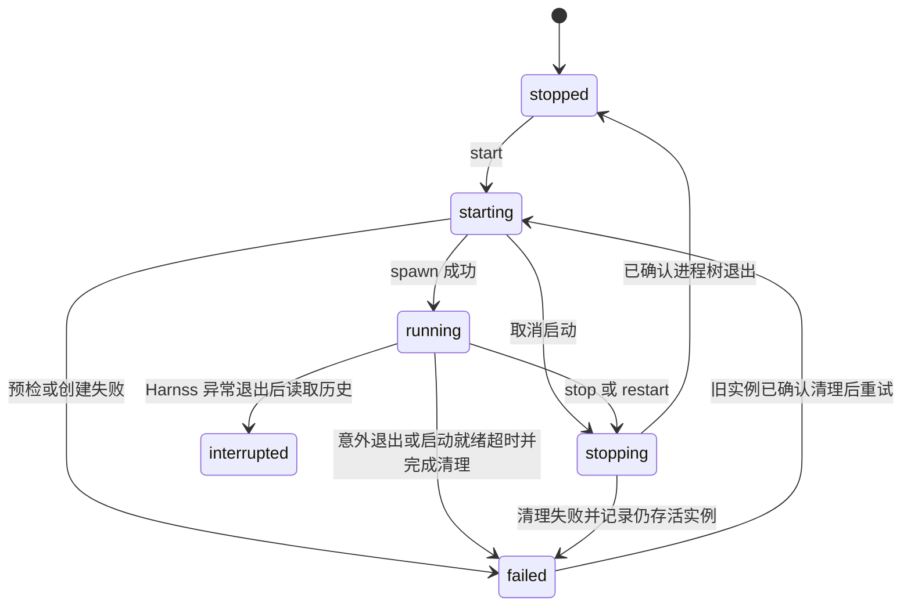

项目应用面板集成计划

日期：2026-10-09。状态：原始设计与交付计划，实施已启动。范围与验收要求保留；实际落地、已运行测试及未验证项见 [实施记录](implementation-status.md)，操作方法见 [使用说明](user-guide.md)。

基线：Harnss `hy_dev`，HEAD `af674c6` 及当前工作区源码；参考 WorldBase `d55cb6f` 的 Launchpad、项目运行管理和文档。工作区已有构建及打包相关改动，实施时应先重新核查其状态，避免覆盖并行工作。

**1. 交付目标。** 在 Harnss 中新增“应用 / Apps”工作区，让用户将项目中的 Web 服务和常用网站保存为应用卡片，完成“添加 → 启动 → 预览 → 查看日志 → 继续优化 → 重启验证”。应用服务由 Electron 主进程管理，界面关闭或会话切换不影响服务。

首版验收场景：用户给现有 Vite 或 Next.js 项目添加应用，选择启动脚本，点击卡片后看到就绪状态并打开预览；发生错误时能查看日志；点击“继续优化”可在所选引擎中创建绑定同一工作目录的会话草稿；修改后手动重启应用并继续预览。

| 范围 | 首版交付 | 后续增强 |
| --- | --- | --- |
| 应用目录 | 本地项目应用、网页快捷方式；名称、图标、收藏、搜索、Space/项目筛选 | 文件夹、拖拽排序、批量操作 |
| 添加应用 | 从已有项目选择启动脚本；从目录接入项目；手动配置进程；保存网址 | 应用模板、一键创建项目 |
| 运行管理 | 启动、停止、重启、日志、退出原因、就绪检测、端口冲突提示 | 多服务组合、依赖拓扑、Docker 专用适配 |
| 预览 | 复用 BrowserPanel；无会话也能预览；外部浏览器打开 | 独立应用窗口、LAN 分享 |
| AI 协作 | 继续优化、绑定工作目录、选择引擎、相关会话、按需附加错误日志 | MCP 工具注册应用、自动启停、API 验证 |
| 导入导出 | 目录接入称为“从目录添加”，避免与安装包混淆 | 配置清单交换、包含源码的应用包 |
| 生命周期 | 普通退出清理托管服务；重启后保留配置和有限运行历史 | 开机启动、后台守护、跨设备同步 |

首版不依赖新的 Agent Loop、Rust、独立数据库服务或 WorldBase 专用项目元数据。既有项目代码与依赖保持由项目自身管理；首次发现脚本只读取元数据，不自动安装依赖或执行脚本。

**2. 已核实的集成基础。** 下列现状决定了实现边界。

| 现有模块 | 核实结果 | 集成决策 |
| --- | --- | --- |
| `electron/src/lib/project-catalog.ts`、`electron/src/ipc/projects.ts` | 项目有稳定 ID、目录和可变 Space 归属 | 应用引用现有项目，不复制项目目录注册表 |
| `src/components/BrowserPanel.tsx` | 浏览器通过 `persistKey` 管理标签，不要求会话参数 | 复用组件，增加受控打开请求与应用预览宿主 |
| `src/components/AppLayout.tsx`、`src/hooks/app-layout/useAppContextualPanels.ts` | 工具布局受活跃会话约束 | 应用作为独立主视图，不仅在 ToolPicker 增加图标 |
| `electron/src/ipc/terminal.ts` | PTY 以 Space 为归属，有日志序号和快照 | 复用日志同步思路；托管应用单独管理进程和身份 |
| `src/hooks/session/types.ts`、`src/hooks/useSessionManager.ts` | StartOptions 未携带固定 cwd；当前项目 worktree 从 localStorage 读取 | 新增会话 workspace binding 并贯穿所有启动路径 |
| `src/hooks/session/useSessionRevival.ts`、`useDraftMaterialization.ts` | 恢复、首次执行仍使用当前项目目录解析 | 应用会话优先使用已保存目录绑定，避免恢复到另一工作树 |
| `electron/src/lib/session-repository.ts` | 有项目删除屏障与 `bindProjectRuntime` 生命周期租约 | 应用运行也注册项目租约，启动与删除遵守同一屏障 |
| `electron/src/ipc/git.ts` | worktree 删除有独立 IPC 入口 | 删除前阻止该工作树新启动并停止其托管实例 |
| `electron/src/lib/atomic-file.ts` | 已有临时文件加 rename 的原子写工具 | 应用配置复用它，补写队列、schema 校验及 revision 检查 |
| `electron/src/lib/productivity-ipc.ts` | 可验证调用者为主窗口主 frame | 新增应用 IPC 使用相同调用者限制 |
| `src/components/workflow/WorkflowCenter.tsx` | 已有关注列表、Review 与跨引擎交接 | 后续运行异常可接入关注列表，首版不新增工作流调度器 |

**3. 用户界面与交互。** 页面以现有主题、ShadCN 和 lucide 风格实现，中英文同步。

- 主入口：侧栏固定“应用”按钮，与聊天、历史、Workflow 的入口协调。允许零会话进入；项目右键菜单增加“添加到应用”，可直接创建绑定该项目的运行配置。
- 导航使用可判别的 workspace/apps/settings 主视图状态，避免多个顶层弹层布尔值互相覆盖。沿用现有设置页的处理方式，切换应用页保持聊天运行树与草稿；应用页切换 Space 仅更新过滤条件，不触发自动恢复历史会话。从全部 Space 预览应用不必切换聊天 Space，进入关联会话时再切换。
- 顶部工具栏：名称搜索、Space 筛选、项目筛选、类型和状态筛选、“添加应用”。默认当前 Space，提供“全部 Space”。输入完整 http(s) URL 时显示“打开网页”和“保存为快捷方式”动作；普通搜索不触发网络请求。
- 主区：响应式卡片网格，窄宽度采用列表。卡片显示名称、图标、所属项目、当前工作目录/分支摘要、状态文字、最近使用时间。运行状态不能只靠绿点表达。
- 添加流程：选择“项目应用”或“网页快捷方式”；项目应用依次选项目/目录、工作树、脚本候选、名称、端口/预览地址。发现多个脚本或包管理器时让用户选择，展示实际 cwd 和执行命令。
- 点击行为：网页卡片直接打开；已就绪的项目打开预览；停止的项目启动并在就绪后打开；启动中重复点击聚焦当前进度；失败卡片打开错误详情。没有预览地址的自定义服务打开运行详情。
- 卡片有明确选中的运行目标：默认使用应用保存的默认目录，也可在卡片/详情切换到某个活跃 run。同应用多 worktree 运行且尚无明确选择时显示目标选择器；预览、停止和继续优化都使用所选目标，不能任意取第一个实例。
- 卡片菜单：启动/停止/重启、打开预览、外部浏览器打开、日志、继续优化、相关会话、编辑配置、收藏、移除应用。
- 详情区：概览、日志、配置、相关会话。概览显示运行目标、实际 URL、启动时间、配置版本、健康状态和退出原因。
- 退出预览回到应用网格时，当前预览实例保留；首版同一时间只保留一个活跃应用预览宿主，切换应用保存 URL 状态并释放旧 webview，避免创建大量隐藏浏览器。网页中的未提交表单不承诺跨应用切换保留。
- 删除应用只删除注册项与有限运行数据，停止对应实例；项目源码不作为此操作的删除目标。移除整个项目时遵守现有项目删除流程。

页面结构示意：

```text
应用   [当前 Space ▼] [项目 ▼] [搜索应用或输入网址……] [添加应用]
       [全部] [运行中] [已停止] [需处理] [收藏]

┌────────────────────┐ ┌────────────────────┐
│ 图标  管理后台       │ │ 图标  API 文档       │
│ project-a · feature │ │ 网页快捷方式         │
│ ● 就绪  :5174       │ │ docs.example.com    │
│ [打开] [停止] [⋯]  │ │ [打开]        [⋯]   │
└────────────────────┘ └────────────────────┘

选择应用后：概览 | 日志 | 配置 | 相关会话
操作：打开预览 / 继续优化 / 重启
```

键盘支持 Tab、Enter/Space、菜单快捷操作和清晰焦点样式；弹窗关闭恢复触发点焦点。状态变化使用节制的 aria-live 提示，不播报每条日志。遵守减少动效设置。

**4. 身份与数据模型。** 分开保存应用定义、工作目录绑定、运行实例和会话来源。

| 对象 | 关键字段 | 约束 |
| --- | --- | --- |
| `ProjectAppDefinition` | `id`、`kind: managed`、`projectId`、名称/图标、`relativeCwd`、启动配置、就绪配置、默认运行目标、`revision`、时间戳 | 一个项目可有多个应用；首版每个应用一个主服务 |
| `WebShortcutDefinition` | `id`、`kind: web`、`spaceId`、名称/图标、`url`、`revision` | 无启动命令和 PID；归属 Space；只接受 http(s) |
| `AppWorkspaceBinding` | `projectId`、`rootKind: project/worktree`、规范化实际根路径、仓库身份、`relativeCwd` | worktree 可在项目目录外，但必须经 Git 验证属于同一仓库；分支名仅用于显示 |
| `AppLaunchProfile` | 结构化命令、非敏感环境覆盖、端口策略、预览地址模板、启动超时、健康检查 | 所有实际命令执行由主进程解析后的配置驱动 |
| `AppRun` | `runId`、`appId`、配置 revision、冻结的 workspace binding、命令快照、实际端口/URL、状态、开始/结束时间、退出原因 | 每次重启生成新 runId；进程句柄只存在主进程内存 |
| `AppSessionLink` | `appId`、workspace binding、稳定会话引用、可选 `runId`、创建时间 | 使用现有逻辑 conversation ID/ConversationRef；不以瞬态引擎 session ID 为唯一关联 |

统一 DTO 放 `shared/types/project-apps.ts`；workspace binding 放 `shared/types/workspace.ts`，由会话和应用共用。用判别联合表达 managed/web、project/worktree、package-script/executable，不以大量可选字段混合互斥状态。

工作目录规则：

1. 应用定义归属项目；本地应用的 Space 从项目实时派生，项目换 Space 后应用随之展示，不重启进程。网页快捷方式直接保存 Space ID。
2. 新建配置时可选择“项目主目录”或固定 worktree。列表筛选、聊天切换、Space 切换均不修改已保存的默认运行目标。
3. 启动时可以显式选择另一已验证 worktree；点击启动即冻结此次 binding。不会依赖之后变化的 `harnss-{projectId}-git-cwd`。
4. 同一 `appId + canonicalRoot + relativeCwd` 只允许一个活跃运行实例；可在不同 worktree 各启动一个实例，卡片详情分别展示，停止按钮必须带明确 runId。
5. `relativeCwd` 经 realpath 后必须位于经验证的根目录内，处理 `..`、符号链接、Windows junction、盘符与大小写。目录不存在时状态为“目录不可用”，提供重新选择。
6. 路径移动通过显式重新绑定修复；绑定修改只影响下一次启动，正在运行的实例继续显示旧绑定。仓库分支变化只刷新展示元数据。

命令定义建议：

```ts
type AppCommand =
  | { kind: "package-script"; manager: "pnpm" | "npm" | "yarn" | "bun";
      script: string; args: string[] }
  | { kind: "executable"; executable: string; args: string[] };
```

可视化配置不默认提供拼接 shell 命令字符串。已有 package script 可以包含 shell 语义，由项目包管理器处理。复杂自定义流程使用项目脚本文件，再用 executable/args 调用；配置页面展示实际执行内容。

**5. 本地存储与事件协议。** 主进程是应用配置和运行状态的唯一权威。

建议目录（位于现有 `getDataDir()` 下）：

```text
project-apps/
  projects/<projectId>.json       # version/revision + 此项目应用定义
  shortcuts/<spaceId>.json        # 网页快捷方式
  runs/<runId>/meta.json          # 有限运行历史；不用于重新接管 PID
  runs/<runId>/output.log         # 有界、经过处理的日志
```

- 配置采用 schemaVersion=1、显式校验、按项目/Space 串行写队列、随机临时文件原子替换；编辑使用 expectedRevision，防两个窗口覆盖。
- 首次启动从空目录开始，不把所有项目自动变成应用。旧版 Harnss 无需迁移现有项目和聊天。
- 配置损坏时保留原文件并显示可恢复错误，不悄悄覆盖为空。应用注册项、运行历史和日志有独立清理范围。
- 建议初始上限：每次运行内存日志 1 MiB，落盘日志 5 MiB，每应用保留最近 20 次结束记录、全局历史日志 256 MiB。超限轮换并显示截断标记；活跃日志也必须有容量上限。
- renderer 的 Zustand store 保存 DTO 缓存、选择项和筛选；localStorage 仅保存视图偏好，不保存权威运行状态。
- 应用状态推送使用单调 revision，日志使用 `runId + seq`。首次进入先订阅再取快照，丢弃快照之前的事件；发现序号缺口后按 cursor 补读，历史已轮换则返回新的起点与 truncated 标记。
- 页面卸载清理订阅；renderer 刷新从主进程重建状态；状态事件与高频日志事件分离。

建议 IPC 统一挂到 `window.claude.projectApps`（沿用当前 bridge 命名），传输层名称为 `project-apps:*`：

| IPC | 输入概要 | 返回/行为 |
| --- | --- | --- |
| `list` / `get` | Space/项目过滤；appId | 注册项、可用性、当前运行摘要 |
| `discover` | projectId、经验证的根目录、相对子目录 | 启动候选、检测依据、缺失依赖；只读 |
| `save` | 定义、expectedRevision | 校验后的新定义与 revision |
| `remove` | appId、expectedRevision | 阻止新启动、停止该应用实例、移除注册；失败可重试 |
| `start` | appId、expectedRevision、选定 workspace binding、requestId | 尽快返回 starting 快照；后续状态用事件推送 |
| `stop` / `restart` | runId、requestId；restart 另带 expectedRevision | 幂等停止；restart 使用指定版本的最新已保存配置，等旧实例清理后创建新实例 |
| `snapshot` | appId 或 runId | 可恢复的完整运行状态 |
| `logs` | runId、afterSeq、limit | 有界日志、nextCursor、截断标记 |
| `prepare-context` | appId、明确选定的 runId 或 workspace binding、是否附日志 | 经验证的会话绑定与有限上下文；目标有歧义则拒绝并要求 UI 选择 |
| `changed` / `run-event` / `log-batch` | 主进程事件 | 配置更新、状态变化、日志增量 |

所有输入按 unknown 验证；返回可判别的错误，如 CONFIG_CONFLICT、TARGET_GONE、COMMAND_NOT_FOUND、PORT_IN_USE、START_TIMEOUT、STOP_FAILED。复用现有主 renderer 校验、存储 ID 校验、safeSend 和 reportError 模式。webview 不能调用这些宿主 IPC。

**6. 脚本发现、端口与就绪检测。** 自动化必须有明确适配范围。

- 读取目标目录的 `package.json`、packageManager 字段及 lockfile；优先把 dev/start/serve 作为候选，同时列出其他脚本。不自动把 build 当常驻服务，也不递归扫描全部 node_modules。
- monorepo 首版由用户选择 package 子目录；发现器可以提供有限候选，但不得自动选择整个仓库中第一个 dev 脚本。
- 包管理器选择优先项目声明和已安装可执行程序；多个 lockfile 时展示冲突；缺失运行时返回修复建议与“打开此目录终端”。不隐式下载执行环境。
- 脚本名不等于应用类型：例如本仓库 start 会启动 Electron，不能仅凭 start/dev 名字宣称检测出 Web 服务。结合依赖与脚本内容生成可审阅候选；Yarn PnP 项目不能仅因没有 node_modules 就被判断为依赖缺失。
- 环境依赖由主进程检查：目录、执行文件、脚本存在、预期配置、端口。Node 子进程启动时清理仅供 Electron/调试用的特殊环境，测试打包版本下的 PATH 和 Electron Node 模式。
- 已知 Vite/Next 适配器支持 loopback host、显式端口与严格占用失败；只有经过测试的适配器允许自动挑选可用端口并传入参数。自定义命令使用用户指定的端口/URL，不假定每个程序都会读取 PORT。
- 端口预检后仍需处理实际 bind 失败；启动成功以自身进程状态、框架启动结果和指定就绪检查共同确认。端口响应或日志出现 URL 不能单独证明本次服务已启动。
- 若端口已被其他进程占用，显示端口冲突。不得按端口杀进程；可选择新端口重新启动，或由用户显式添加一个已有服务的网址快捷方式。
- 默认启动超时 60 秒，可配置。HTTP 检查默认只允许本次配置的 loopback URL、200–399 状态和有限响应大小；登录页返回 401 等情况需显式配置接受状态。重定向重新验证目标，不跳转到任意网络地址。
- 自定义服务可以选择“只检查进程存活”，此时显示“运行中，未验证就绪”；有检查的应用仅在通过后显示绿色“就绪”。运行中检查失败显示“异常”，保留真实进程状态，不假装已停止。

**7. 进程管理和生命周期。** 新增 `ProjectAppRuntimeManager`，通过平台适配器持有实际进程及其清理逻辑，不向普通终端写入命令来模拟托管运行。

状态拆成两个维度：processPhase（starting/running/stopping/stopped/failed/interrupted）和 health（unknown/checking/ready/unhealthy）；“目录丢失”等属于定义的 availability。



- 每个实例键串行化操作；requestId 防双击重放。start 返回已有活跃实例；restart 等待旧实例退出与端口释放。停止失败时保留句柄和阻止重启，不能仅将 UI 改成 stopped。
- restart 保留所选运行的项目/worktree 根目录，使用通过 expectedRevision 校验的最新已保存启动配置。若 relativeCwd 已修改，应重新解析目录、校验新的实例键是否冲突；先完成配置预检，再停止旧服务。重放旧配置快照不属于默认重启语义。
- 每次启动分配新的 runId；异步 stdout/exit/health callback 必须匹配所属 runId。旧进程迟到的退出事件不能覆盖新实例。
- 在任何异步预检前取得项目生命周期租约；每个关键 await 后复核租约、应用 revision 与取消信号。删除在 spawn 前后发生都能终止启动。
- Windows 隐藏子进程窗口，明确解析 `.cmd` 包管理器入口和带空格/中文的 executable/args；POSIX 使用可控进程组。提供 `process-tree` 平台适配器，优先温和停止，5 秒后限时强制，10 秒后仍未清理则报告 STOP_FAILED。
- Windows 的 pnpm/npm 中间进程及孙进程清理是 P0 技术验证门槛。若现有 Node 进程树方案不能可靠覆盖包装进程退出场景，实施 Windows Job Object/helper 方案并计入打包；不能以“杀掉根 PID”替代验收。只清理本次运行所属的进程树，不按进程名或持久化旧 PID 批量终止。
- 普通退出在现有 will-quit 清理 Promise 中 await 所有应用停止。隐藏窗口或切换会话不停止；真正退出默认停止全部托管应用。
- stopAll 采用 allSettled 式汇总，单个失败不提前结束其他清理。总等待设 15 秒上限；截止仍有未确认退出的实例时记录失败并显示退出阻塞及继续清理入口。只有用户显式选择强制退出才允许放弃确认，并保存残留说明；避免直接复用任意 finally 中的 app.exit 而掩盖清理失败。
- 主进程崩溃后，所有未确认结束的 starting/running/stopping 历史，以及停止失败且可能仍存活的实例，统一标记 interrupted/归属未知；不自动根据 PID 接管或终止。重试启动先检查实际端口。首版不承诺断电/强杀后无残留，正常退出和显式停止必须完整清理。
- 系统睡眠/唤醒后重新检查健康；发现进程退出如实更新状态，不默认无限重启。
- 删除项目复用现有 tombstone/lease 屏障，并清理其应用定义与历史关联。配置清理必须可重试；启动时也过滤/回收已删除项目的遗留注册项，避免中途崩溃后复活。
- 删除 worktree 先取得该根目录的删除屏障，停止绑定的应用并确认退出，再调用原有 Git 删除。失败时保留状态与错误，所有后续启动重新验证 worktree 是否存在。
- 删除 Space 按现有项目迁移语义处理本地应用；网页快捷方式迁移至默认 Space。运行实例随项目继续存在，不把 Space 当作进程所有者。

**8. 浏览器集成。** 增加应用专用预览宿主，复用当前 BrowserPanel/WebviewInstance。

- BrowserPanel 增加明确的打开请求接口，例如 `{ requestId, url, appId, runId }` 与 handled 回调；网页快捷方式不携带 runId。重复 requestId 不重复开标签；实例关联用于重启后的定向更新。
- 应用预览使用独立 persistKey（含 appId 与工作目录身份），不覆盖聊天浏览器标签；真正的运行 URL 由 AppRun 提供，不能从旧 localStorage 端口推断。
- 不同时挂载两个使用同一 persistKey 的 BrowserPanel，避免标签状态互相覆盖。页面返回时恢复应用自己的预览位置。
- 运行时自动分配新端口后，只有对应实例的新打开请求使用新 URL；已停止应用的旧页面显示停止提示，不自动打开可能占用该端口的其他服务。
- 外部网页只允许 http(s)；`file:`、`javascript:` 等不作为快捷方式。图标首版使用 emoji/lucide，不自动抓任意远程 favicon。
- 新预览保持 contextIsolation、无 Node 集成、无主窗口 preload；校验 webview 弹窗和导航协议。外部页面的登录状态沿用明确的浏览器会话策略，不把 persistKey 当 cookie 隔离机制。
- 无活跃聊天时隐藏网页元素“发送到当前会话”动作；有应用关联时可通过“继续优化”创建绑定正确项目的草稿，再附选中元素。

**9. “继续优化”与三引擎接入。** 首版采用可审阅的会话草稿；手动打开原会话也是明确操作。

1. 主进程 prepare-context 验证应用、运行实例与根目录，返回 appId、workspace binding、配置 revision、实际 URL、状态摘要。日志默认不附；用户选择“附加最近错误日志”后加入有界、脱敏的尾部文本。
2. 界面选择 Claude/Codex/ACP 与现有模型、权限设置，复用 buildSessionOptions。为新会话生成稳定 conversationId，保存应用来源；草稿展示可编辑的任务描述，用户发送后执行。
   创建应用会话前保护现有未发送草稿，参考 useQuickCapture 的保存与身份就绪检查；不得把应用提示插入另一会话或覆盖现有输入。单独打开/启动应用不调用 createSession，因此不会触发已有 eager-start 的 Agent 连接。
3. 新增 `StartOptions.workspaceBinding`、会话持久化 `workspaceBinding` 与 `origin`（例如 project-app 来源）。字段对旧会话可缺省，对新建应用会话必须完整提供。
4. 修改 draft materialization、session CRUD/cache、首次启动、revival、restart、extra pane load 和保存元数据链路：已绑定会话必须优先解析绑定目录，不能重新读取全局当前 worktree。目录已删除则提示重新绑定，不默默退回项目主目录。
5. 覆盖 `src/lib/session/records.ts`、`shared/lib/session-persistence.ts` 以及手工构造持久化对象的路径，保证应用上下文不在保存/恢复中丢失。新增字段不影响旧会话原有回退逻辑。
6. UI 关联使用逻辑会话引用；引擎重启、Claude 回退或 runtime ID 更新后仍可找到会话。会话删除后链接显示已删除并允许新建，不阻塞应用运行。
7. 将来自项目文件/日志的内容标记为引用数据，禁止作为高权限指令注入；模型接收的上下文设字符/token 上限。应用名称和 URL 也作为普通数据处理。

首版完成后，三个引擎都能收到应用上下文、修改源代码并由用户在面板中重启。不能把“上下文接入”宣传为 Agent 已能自动控制应用生命周期。

**10. 后续 Agent 工具层。** 在首版运行服务稳定后，通过独立 MCP bridge 暴露同一个服务，避免三套业务实现。

- 只读工具：`apps_list`、`apps_status`、`apps_logs`，按会话 project/worktree/app 范围过滤。
- 变更工具：`apps_start`、`apps_stop`、`apps_restart`，只操作已保存且获准的配置；Agent 不能在 start 参数里绕过配置传任意命令。
- `apps_register` 先提交候选配置，由宿主显示配置差异并批准；用户修改或重新确认配置后才能执行。批准与配置 revision/hash 绑定，配置变化使批准失效。
- bridge 可用 stdio 子进程转发到主进程私有 control channel；使用短期 token、会话/项目/worktree 范围和撤销机制，不开放无鉴权管理端口。
- 必须由宿主验证变更权限；不能仅假定每个 ACP 实现都会显示同样的工具审批。无可验证的宿主授权时，保持只读或请求宿主 UI 处理。
- 各引擎按已有 MCP 注入路径配置；服务变化按引擎实际能力选择新会话/重启/显式重连，不承诺通用热加载。
- 可选 `apps_request` 仅调用当前托管实例已验证的本地 origin，限定 method、超时、响应大小、重定向及凭据处理。API 可用与业务正确性分别报告。
- 相关改动预计涉及 `claude-sessions.ts`、`codex-sessions.ts`、`acp-sessions.ts`、MCP 配置转换与 tsup 入口；具体复用 computer-use/memory 注入结构，鉴权和权限实现需单独测试。

**11. 建议文件落点。** 路径为相对仓库路径；“新增”项是计划中的文件，尚不存在。

| 类别 | 文件 | 职责 |
| --- | --- | --- |
| 新增共享类型 | `shared/types/project-apps.ts`、`shared/types/workspace.ts` | 定义、运行状态、IPC DTO、目录绑定 |
| 新增校验 | `shared/lib/project-apps.ts` | 可跨进程运行的纯校验/归一化；不引入 Electron/React |
| 新增主进程服务 | `electron/src/lib/project-apps/store.ts`、`service.ts` | 持久化、版本、注册和生命周期编排 |
| 新增运行模块 | `electron/src/lib/project-apps/runtime.ts`、`process-tree.ts`、`command-resolver.ts` | 运行实例、跨平台进程、可执行文件解析 |
| 新增配套模块 | `electron/src/lib/project-apps/discovery.ts`、`workspace.ts`、`health.ts`、`logs.ts` | 发现候选、目录验证、健康检查、限额日志 |
| 新增 IPC | `electron/src/ipc/project-apps.ts` | 主 renderer 鉴权、输入校验、事件分发 |
| 修改进程入口 | `electron/src/main.ts`、`preload.ts`、`src/types/window.d.ts` | 注册服务、bridge、启动与退出清理 |
| 修改删除集成 | `electron/src/lib/session-service.ts`、`session-repository.ts`、`electron/src/ipc/git.ts` | 项目/worktree 删除屏障和配置回收 |
| 新增 UI | `src/components/apps/ProjectAppsPage.tsx`、`AppGrid.tsx`、`AppCard.tsx`、`AddAppDialog.tsx`、`AppDetailsPanel.tsx`、`AppLogsView.tsx`、`AppPreviewHost.tsx` | 页面、卡片、配置、日志和预览 |
| 新增 UI 状态 | `src/hooks/useProjectApps.ts`、`src/hooks/app-layout/useAppLaunchActions.ts`、`src/stores/project-apps-store.ts` | 订阅/快照、动作编排、细粒度状态 |
| 修改 UI 入口 | `src/components/AppLayout.tsx`、`AppSidebar.tsx`、`src/hooks/app-layout/useAppLayoutUIState.ts` | 独立应用视图、无会话入口、返回导航 |
| 修改 Space 导航 | `src/hooks/app-layout/useAppSpaceWorkflow.ts` | 应用视图筛选与聊天恢复分离；Space 删除后的项目/快捷方式归属 |
| 修改浏览器 | `src/components/BrowserPanel.tsx`、`src/components/browser/*` | URL 打开请求、应用目标关联、无会话预览 |
| 修改会话 | `src/hooks/session/types.ts`、`src/types/session.ts`、`shared/lib/session-persistence.ts`、`src/lib/session/records.ts` 及 session hooks | 固定目录、来源和完整保存/恢复链路 |
| 修改本地化 | `src/lib/i18n.tsx` 及其语言资源 | 中英界面、状态、错误与无障碍文案 |
| 后续新增 | `electron/src/project-apps-mcp.ts`、`tsup.electron.config.ts` | MCP bridge 与打包入口；不作为首版前置依赖 |

组件按职责拆分。应用页面按需加载；卡片按 app/run ID 订阅状态，日志只更新日志视图。日志批量推送建议 50–100ms；大列表与长日志使用真实虚拟化，不使用 content-visibility 代替窗口化。不在 AppLayout 内实现运行管理或把日志数组传入聊天渲染树。

**12. 实施阶段与依赖。** 工时是单名熟悉项目的开发者的初步工程日估算，包含定向测试，平台环境可用性会影响验收。首版为 P0–P5，总计约 12–19 个工程日；实施前以 P0 结果校正。

| 阶段 | 工作与建议拆分 | 依赖 | 完成标准 | 估算 |
| --- | --- | --- | --- | --- |
| P0 契约与技术验证 | 确定 DTO/状态、worktree 身份、会话绑定；验证 Windows 包管理器与子进程树停止；确认无会话预览路径 | 无 | 真实 Vite/Next 启停样例、三引擎 cwd 传递路径核对、协议评审结论 | 1–2 日 |
| P1 应用注册 | store/IPC/preload、只读 discovery、定义校验、快捷方式、增删改与损坏恢复 | P0 | 重启保留应用；并发编辑不丢更新；读取脚本不执行命令 | 2–3 日 |
| P2 运行服务 | runtime、命令解析、进程树、端口/健康、日志、主进程退出及项目/worktree 删除集成 | P0/P1 | 可直接通过服务运行/停止真实样例；竞态与正常退出清理通过 | 3–5 日 |
| P3 应用页面 | 入口、搜索筛选、卡片、添加流程、详情日志、独立预览、键盘和中英文 | P1；UI 骨架可与 P2 并行 | 无聊天可完成添加/启动/预览/停止；错误可理解可重试 | 2–3 日 |
| P4 继续优化 | workspace binding 全链路、应用来源、草稿上下文、相关会话 | P0/P2/P3 | 三引擎新建/恢复/重启保持目录；切换 Space 不改变目标 | 2–3 日 |
| P5 发布验证 | 单元/真实子进程/GUI/打包回归、容量测试、迁移与帮助文档 | P1–P4 | 验收矩阵有证据；构建与类型检查新增问题清零 | 2–3 日 |
| P6 Agent 自动管理 | MCP bridge、范围授权、只读与启停工具、可选 API 验证 | P5 | 三引擎工具操作与宿主 UI 状态一致、权限撤销有效 | 另估 3–5 日 |
| P7 交换与组织 | 清单导入导出、文件夹/排序；源码包另行设计 | P5 | 配置可移植且导入不执行命令、不携带秘密 | 按选定范围另估 |

建议每阶段形成独立可审查提交/PR，P2 可拆为“进程与日志”和“生命周期与健康”两部分，P4 可先交付 workspace binding 基础。阶段未完成时，通过内部开发开关隐藏不完整入口；首版正式开放须完成 P0–P5。

**13. 测试与验收矩阵。** 使用现有 Vitest，不为样式或简单可逆文案增加镜像测试；集中验证状态、权限边界和跨进程行为。

| 场景 | 必须观察到的结果 |
| --- | --- |
| 零会话、零项目 | 能进入应用页并添加网址；本地应用引导选择项目 |
| Vite/Next 项目 | 脚本发现正确、点击启动后地址可用、停止后子进程与端口释放 |
| 自定义服务/缺运行时 | 不注入错误框架参数；缺失依赖提示实际修复入口 |
| 路径含空格/中文、Windows `.cmd` | 使用真实项目验证 executable/args/cwd 解析，不只测试字符串拼接 |
| 同应用重复启动 | 幂等返回同一运行；不会创建重复服务 |
| 启动中停止/重启/移除应用 | 取消信号贯穿预检与 spawn，不产生漏管进程 |
| 两个 worktree 同时运行 | 独立实例/端口/日志；操作一方不影响另一方 |
| 切换 Space/worktree | 正在运行的实例和应用会话目录保持原绑定 |
| 项目或 worktree 删除与启动并发 | 删除屏障生效；停止失败时不能继续删除工作树 |
| 端口占用、预检后被抢占 | 显示真实错误，不误报就绪，不终止陌生进程 |
| 启动日志写出 URL 后进程退出 | 不将旧 URL 当作就绪依据；显示退出码和尾部日志 |
| 包管理器父进程退出、孙进程继续 | 仍能按运行归属清理，或明确阻止发布并完成平台方案修复 |
| renderer 刷新/订阅中断 | 快照与 seq 恢复；不重复日志，不虚构运行状态 |
| 旧 run 的迟到事件 | 不覆盖新 run 的状态或日志 |
| 主进程普通退出 | await 清理所有托管实例，记录最终状态 |
| 主进程强杀后重启 | 历史为 interrupted，不按旧 PID 杀其他进程 |
| 高频日志与超长单行 | IPC/内存/磁盘有界；日志视图不卡聊天；截断有提示 |
| 恶意来源 IPC/URL/路径 | webview 调用被拒绝；不读取越界路径；无非法协议导航 |
| 配置并发编辑/损坏/磁盘写失败 | revision 冲突可理解；保留原数据；不报告保存成功 |
| 三引擎继续优化 | 草稿/首次执行/恢复/重启均使用绑定 cwd，逻辑会话链接稳定 |
| 删除/修改相关会话 | 应用仍可运行；失效会话链接有明确状态 |
| 全局搜索/筛选/快捷方式 | Space 与项目移动后归属正确，网页项不显示假 PID 或服务运行状态 |

测试分层：纯函数覆盖 schema、命令候选、实例键、路径/URL规则；服务集成测试用真实临时 HTTP 服务和子/孙进程覆盖生命周期；Electron GUI 验证无会话入口、浏览器预览、Space 切换和草稿；最终安装包验证 PATH、原生依赖、子进程与退出行为。

建议性能目标（实施时记录机器与样本，尚非测量结果）：500 个注册项搜索输入反馈 <100ms；50,000 行日志仅渲染可视窗口；每活跃实例内存日志遵守 1 MiB 上限；后台运行不触发整页/聊天每条日志重渲染。

必要命令：

```text
pnpm test
pnpm exec tsc --noEmit
pnpm exec tsc --project electron/tsconfig.json --noEmit
pnpm build
pnpm dist:fast
```

先记录已有类型/构建诊断，再判断新增回归。安装包在 Windows、macOS、Linux 分别验证；某平台未验收时明确标注范围，不能由另一平台测试替代。当前 Vitest 默认 node 环境，真实 UI/浏览器行为需要 Electron GUI 验证，不应宣称普通单元测试覆盖了它们。

**14. 发布与数据回退。** 新目录和可选会话字段采用加法变更。试运行期关闭功能开关时，先停止运行服务，保留定义和历史供再次启用。关闭面板本身不停止服务。

旧版本忽略新增存储，但不保证旧版本重写会话后保留未知 workspace binding 字段；升级/降级前需备份相关会话元数据，回退验收不能声称未知字段天然无损。P5 文档需记录 schema 版本、清理入口和功能限制。

日志可能包含项目输出的敏感内容：本地有界保存，屏蔽已知秘密值，不自动发往统计服务；用户主动附给 Agent 时显示发送范围。不可保证任意程序的自由文本输出都能完全识别秘密。首版不提供保存明文密钥的配置输入，敏感环境由项目自身配置读取；后续秘密存储应使用独立安全存储，不导出实际值。

**15. 后续导入导出边界。** 建议先交付配置清单，再决定是否支持源码包。

- 清单包含 schemaVersion、应用元信息、相对目录、脚本、端口/健康配置；不包含本机绝对路径、PID、日志、会话正文、秘密值或运行时授权。
- 导入后重新绑定本地项目/worktree，展示命令与配置，保存为未运行状态；不得自动执行 install/start。
- 如实现源码 ZIP 包，单独定义包版本、体积/文件数限制、路径穿越和符号链接策略、目标目录冲突与源码许可证保留；默认排除 `.env`、依赖目录和 Git 历史。WorldBase 包格式不能未经转换就承诺兼容。

参考依据：

- [WorldBase 用户手册：Launchpad、项目运行壳、项目包](https://github.com/RZfive/WorldBase/blob/d55cb6fcb22e5b19bb37b34174ec2fb922067184/docs/user-manual.md)
- [WorldBase Electron 项目运行管理](https://github.com/RZfive/WorldBase/blob/d55cb6fcb22e5b19bb37b34174ec2fb922067184/apps/electron/src/main/project-runtime/runtime-manager.ts)
- [Harnss 架构与开发约定](../../CLAUDE.md)
- [现有功能验证范围](../productivity-enhancements/implementation-status.md)

本计划根据源码阅读制定。所列测试、工时和性能目标均为后续实施与验收要求，不代表本次已经运行或通过。
