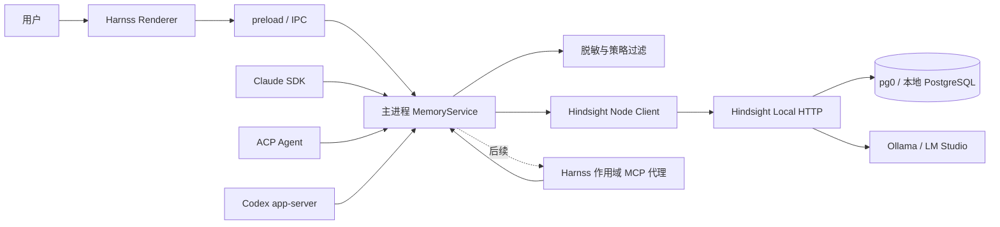

# Harnss 本地私人 Agent（Hindsight 记忆）实施计划

## 1. 文档信息

- 状态：实施前计划
- 目标：让 Harnss 成为一个本地优先、越用越懂用户，并且可以快速查看和分析记忆的私人 Agent
- 计划目录：`plans/hindsight-private-agent/`
- 适用版本：当前 Harnss Electron 40、React 19、TypeScript 5.9 架构
- 主要依赖：Hindsight 开源本地服务（MIT）、`@vectorize-io/hindsight-client`、可选 Ollama 或 LM Studio

本计划只描述实施方案，不在本次任务中修改源码，也不把 Hindsight Cloud 作为本地功能的隐式依赖。

## 2. 结论先行

这个目标可行。Harnss 已经具备项目、空间、会话持久化、MCP、三类 Agent 引擎和 Electron 主进程，最合适的方案是在主进程增加一个统一的 `MemoryService`，由它连接本机 Hindsight，并通过 IPC 向界面提供记忆检索、编辑、删除和分析能力。

第一版建议采用以下边界：

1. 只支持本地 Hindsight HTTP 服务，地址默认为回环地址，并允许用户配置。
2. Hindsight 使用 pg0/本地 PostgreSQL 存储；模型调用默认指向 Ollama 或 LM Studio。
3. Harnss 直接使用 Hindsight Node 客户端完成自动 `recall` 和 `retain`；第一版不让 Agent 直接连接 Hindsight MCP。
4. 三类引擎的 retain 统一挂在 `sessions:save` 的主进程入口；Claude 只需增加自动 recall。Agent 可见的记忆工具放到后续的 Harnss 作用域 MCP 代理。
5. 第一版不把 Python、PostgreSQL、Hindsight 服务完整打进 Electron 安装包；先提供检测、启动说明和健康状态。
6. 记忆默认可关闭，严格本地模式默认关闭匿名分析，任何记忆内容都不能进入 PostHog 或普通日志。

## 3. Hindsight Cloud 与本地部署边界

Hindsight Cloud 是 Vectorize 提供的独立托管服务，不是 Hindsight 开源仓库中随项目自动启用的云端后端。使用开源项目自行部署时，数据会写入用户指定的本地 Hindsight 服务及其本地数据库；如果 Hindsight 的模型配置指向 Ollama 或 LM Studio，抽取和分析模型也可以完全在本机运行。

| 模式 | 数据位置 | 网络要求 | 本计划定位 |
| --- | --- | --- | --- |
| Harnss + 本地 Hindsight | 本机 Hindsight/pg0 或用户自建本地 PostgreSQL | Harnss 到 `127.0.0.1` | 第一版默认方案 |
| Harnss + 本地 Hindsight + Ollama/LM Studio | 记忆和模型均在本机 | 可完全离线 | 隐私优先推荐方案 |
| Harnss + Hindsight Cloud | Vectorize 托管环境 | 需要外网和 Cloud 凭据 | 后续可选，不在第一版默认开启 |

实现上必须把本地 URL 和 Cloud URL 分开建模。第一版不提供 Cloud 登录流程，也不允许通过远程 URL 静默上传会话内容。若未来加入 Cloud，必须由用户显式选择并显示数据位置、组织、保留策略和凭据状态。

## 4. 目标、非目标与验收标准

### 4.1 目标

- Harnss 能从对话中抽取稳定的用户偏好、事实、项目决策和工作习惯。
- 新会话开始或用户发送消息前，Agent 能检索相关记忆并使用它们。
- 用户能快速搜索、查看、编辑、合并、禁用、删除和导出记忆。
- 用户能按时间、项目、来源、类型和标签分析记忆，并用 `reflect` 生成带来源的总结。
- 记忆按用户、空间、项目和会话来源隔离，项目记忆不会泄露到其他项目。
- Hindsight 不可用、服务停止或本地模型离线时，聊天主流程仍可工作。

### 4.2 非目标

- 第一版不实现完整的个人知识库编辑器或替代 Obsidian。
- 第一版不自动记录全部终端输出、文件全文、环境变量或工具参数。
- 第一版不将每个 token 或每个工具事件都写入 Hindsight。
- 第一版不复制 Hindsight 的存储、向量索引和图谱实现。
- 第一版不默认连接 Hindsight Cloud。

### 4.3 完成标准

在一台新机器上，用户完成本地 Hindsight 和 Ollama/LM Studio 配置后：

1. Harnss 能显示 Hindsight 和模型服务的健康状态。
2. 用户在对话中表达“我偏好……”“以后项目都……”后，记忆中心能看到对应记忆和来源。
3. 新会话提出相关问题时，Agent 能在不重复询问的情况下使用该记忆。
4. 用户删除或禁止某条记忆后，后续召回不会再次使用它。
5. 关闭 Hindsight 服务后，聊天仍能发送和保存，只显示记忆不可用状态。
6. 导出的记忆文件可以重新导入，跨项目数据不会混淆。

## 5. 当前代码基础与约束

现有实现为主进程负责 SDK、MCP 和持久化，Renderer 通过 preload/IPC 访问能力。实施时应沿用以下现有边界：

- MCP 配置类型和构建器：`shared/lib/mcp-config.ts`。
- 项目 MCP 存储：`electron/src/lib/mcp-store.ts`。
- Claude MCP 注入：`electron/src/ipc/claude-sessions.ts`。
- ACP MCP 注入：`electron/src/ipc/acp-sessions.ts`。
- Codex app-server 启动：`electron/src/ipc/codex-sessions.ts`；当前项目 MCP 尚未完整传入，需要单独补齐。
- 会话消息模型：`src/types/session.ts` 的 `UIMessage`/`PersistedSession`。
- 会话文件和全文搜索：`electron/src/ipc/sessions.ts`。
- 主进程配置：`shared/types/settings.ts`、`electron/src/lib/app-settings.ts`、`electron/src/ipc/settings.ts`。
- 加密 JSON 存储：`electron/src/lib/json-file-store.ts`，可用于敏感配置迁移。
- IPC 暴露入口：`electron/src/preload.ts`、`src/types/window.d.ts`。
- 所有 IPC 模块在 `electron/src/main.ts` 注册。
- `useSessionPersistence` 会以防抖方式把三类引擎的完整 `PersistedSession` 写入 `sessions:save`；它是统一 retain 的入口，但不能把每次快照直接视为完成回合。

Hindsight 的 Node 客户端和本地 daemon 启动器都需要在实现阶段核对当前版本 API。计划中不能把 SDK 返回字段直接散落到 UI，必须通过适配层归一化。

## 6. 总体架构



第一版的 Agent 自动记忆路径全部经过 `MemoryService`。后续若需要 Agent 主动调用 `remember/search` 工具，必须接入 Harnss 自己的作用域 MCP 代理，由代理把当前 session 的固定 scope 传给 `MemoryService`；不能把 Hindsight 官方 MCP endpoint 直接放进 Agent 配置。

### 6.1 进程边界

- Renderer 只负责展示和发起用户操作，不直接访问 Hindsight URL、文件或密钥。
- 主进程 `MemoryService` 负责 URL 校验、凭据、脱敏、队列、超时、重试、缓存和错误降级。
- Hindsight 负责事实抽取、语义检索、知识图谱、observations、mental models 和 knowledge pages。
- Agent 引擎只接收经过长度限制和策略过滤的记忆上下文。

### 6.2 数据流

```text
用户输入
  -> 当前会话上下文
  -> recall（项目记忆 + 全局偏好）
  -> 生成受限的 Memory Context
  -> Agent turn
  -> turn 完成
  -> transcript formatter
  -> redaction / dedup / queue
  -> retain
```

`reflect` 只在用户主动分析、Memory Center 生成摘要或后台任务触发时运行，不能在每个 turn 自动执行。

## 7. 记忆分层和 Bank 设计

### 7.1 记忆层次

1. **原始会话层**：Harnss 现有的 `PersistedSession.messages`，用于聊天回放和本地全文搜索。
2. **长期记忆层**：Hindsight `retain` 抽取的用户偏好、稳定事实、习惯、约束和重要决定。
3. **项目知识层**：与项目、空间、分支相关的架构决定、工作流、代码约定和项目背景。
4. **分析层**：Hindsight observations、mental models、knowledge pages，以及由 `reflect` 生成的带来源分析结果。

原始会话和长期记忆必须分开保存。删除聊天记录时，默认只删除原始会话；删除长期记忆必须提供独立操作，并在界面中清楚说明影响范围。

### 7.2 Bank 规则

第一版使用两个稳定 Bank：

```text
user-{stableUserId}       # 全局用户偏好和跨项目事实
project-{projectId}       # 项目知识、决策、分支相关记忆
```

第一版 `stableUserId` 固定为 `user-local`。它不复用 `analyticsUserId`，也不上传或参与匿名分析；每个操作系统用户的 Electron `userData` 目录天然提供本地隔离。未来支持多用户配置时再引入独立的本地身份标识。

会话、分支、空间和引擎使用 metadata/tags 标记，不为每个 session 创建 Bank。这样可以避免 Bank 数量失控，也便于跨会话分析。

所有 retain/recall/reflect 请求至少携带：

```ts
{
  projectId: string;
  spaceId?: string;
  sessionId?: string;
  branch?: string;
  engine?: "claude" | "acp" | "codex";
  sourceMessageId?: string;
  sourceTimestamp?: number;
}
```

Bank resolver 必须是纯函数，并对未知或非法 ID 做稳定编码，避免将路径分隔符、空格或敏感原文放入 Bank 名称。

### 7.3 记忆类型

适配层统一输出以下类型，Hindsight 的原始字段保留在 `raw` 中但不直接暴露给 UI。第一版只承诺查看和删除；编辑、禁用和合并要等 P0 确认 Hindsight 能力后再加入：

```ts
type MemoryKind =
  | "preference"
  | "fact"
  | "project_decision"
  | "workflow"
  | "episodic"
  | "instruction"
  | "observation"
  | "mental_model"
  | "knowledge_page";
```

每条可展示记忆至少包含：`id`、`text`、`kind`、`bankId`、`projectId?`、`tags`、`sourceRefs`、`createdAt`、`updatedAt`、`confidence?`。如果 Hindsight 不提供禁用能力，Harnss 只能在本地维护删除 tombstone，并在所有 recall 路径过滤；不能假设存在 `disabled` 状态。

## 8. 主进程 MemoryService 设计

建议新增目录：`electron/src/lib/hindsight/`。

```text
electron/src/lib/hindsight/
├── client.ts            # Hindsight Node client 封装和版本兼容
├── service.ts           # 业务入口：status/recall/retain/delete/tombstone
├── bank-resolver.ts     # user/project Bank 和 metadata
├── redaction.ts         # secret、token、路径和终端输出脱敏
├── transcript.ts        # UIMessage -> 可 retain 的文本/结构
├── queue.ts             # 串行队列、去重、重试和关闭时排空
├── health.ts            # Hindsight/模型服务探测
├── local-runtime.ts     # 可选 daemon 检测、启动提示和进程生命周期
└── types.ts             # 主进程内部类型
```

`service.ts` 还要提供统一的会话快照入口：

```ts
interface SessionMemoryIngestor {
  ingestSessionSnapshot(input: {
    projectId: string;
    sessionId: string;
    engine?: "claude" | "acp" | "codex";
    messages: UIMessage[];
    branch?: string;
    spaceId?: string;
  }): Promise<void>;
}
```

`electron/src/ipc/sessions.ts` 在成功写盘后以 `void` 方式调用它，不能让 Hindsight 网络或模型延迟阻塞会话保存。ingestor 必须按 `sourceMessageId + contentHash` 去重，只提取新增且已经稳定的 user/assistant 回合；`isStreaming`、队列消息、重复快照、历史导入和仅更新标题/设置的保存都不能触发重复 retain。若当前消息结构无法可靠判断回合完成，先记录候选并等待下一次稳定快照，不能在每个防抖保存上调用模型。

### 8.1 Client adapter

`client.ts` 只依赖 `@vectorize-io/hindsight-client`，并提供：

```ts
interface HindsightClient {
  getVersion(): Promise<string>;
  retain(input: RetainInput): Promise<RetainResult>;
  retainBatch(input: RetainBatchInput): Promise<RetainResult[]>;
  recall(input: RecallInput): Promise<RecallResult>;
  deleteMemory(input: DeleteMemoryInput): Promise<void>;
  // 第二版能力：reflect/mental-model/knowledge-page
}
```

客户端必须统一设置请求超时、取消信号和最大返回条数。Hindsight API 版本变动只能在此层处理，不能让 UI 和引擎依赖 SDK 的具体返回结构。

### 8.2 Transcript formatter

默认只处理：

- 用户消息的可见文本。
- Assistant 最终回答的可见文本。
- 明确标记为项目决定、偏好或“记住这件事”的内容。
- 工具调用的摘要和结果摘要（默认不保存完整参数和完整输出）。

默认排除：

- 完整终端输出、二进制内容和大文件内容。
- 环境变量、Authorization、API key、cookie、私钥和密码。
- 未完成的流式消息、思考内容和权限请求内容。
- 超过单条大小上限的工具结果。

### 8.3 Redaction policy

脱敏策略分三层：

1. 结构化字段：删除 `env`、`headers`、`token`、`secret`、`password`、`authorization` 等字段。
2. 模式匹配：识别常见 API key、JWT、私钥块、Bearer token、连接字符串和 GitHub token。
3. 内容策略：对路径、域名和项目名保留可检索的最小信息；对疑似秘密替换为 `[REDACTED]`。

脱敏结果和拒绝原因只写入本地 debug 日志的计数信息，不能写出原始秘密。

### 8.4 Queue 和降级

- 同一 `sessionId` 的 retain 按完成顺序串行执行。
- 使用 `sourceMessageId + contentHash` 去重，必要时持久化已处理游标，避免应用重启、React 重试或会话切换造成重复写入。
- 网络错误使用有限次数指数退避；4xx 参数错误不重试。
- 队列上限和单条大小必须有明确配置，超过上限时丢弃低优先级事件并保留用户显式记忆。
- Hindsight 不可用时，聊天、会话持久化和项目操作继续运行；UI 显示“记忆服务不可用”，不弹出阻塞式错误。
- 应用退出前尝试排空队列，但不能延迟退出超过固定时间。

## 9. IPC 与类型契约

### 9.1 Shared 类型

新增 `shared/types/memory.ts`，并在 `src/types/` 增加 re-export。建议包含：

```ts
export interface MemoryScope {
  projectId?: string;
  spaceId?: string;
  sessionId?: string;
  branch?: string;
  engine?: EngineId;
}

export interface MemorySearchQuery extends MemoryScope {
  text: string;
  kinds?: MemoryKind[];
  tags?: string[];
  limit?: number;
  offset?: number;
}

export interface MemorySearchResult {
  items: MemoryItem[];
  total?: number;
  serviceStatus: "ready" | "disabled" | "unavailable";
}
```

内部能力需要显式建模，而不是假设 Hindsight 一定支持原地编辑或禁用：

```ts
interface MemoryCapabilities {
  canDelete: boolean;
  canUpdateText: boolean;
  canDisable: boolean;
}
```

### 9.2 IPC 方法

在 `electron/src/ipc/memory.ts` 注册，在 `electron/src/preload.ts` 和 `src/types/window.d.ts` 暴露：

```text
memory:status                 # Hindsight、模型、配置和最近错误
memory:search                 # 关键词/语义搜索和筛选
memory:get                    # 查看单条记忆及来源
memory:remember               # 用户显式保存一条记忆
memory:forget                 # 第一版：永久删除一条记忆，并写入本地 tombstone
memory:settings               # 读取记忆相关设置

# 第二版能力，P0 确认 Hindsight 原生支持后再开放
memory:update                 # 编辑标签、类型、文本或启用状态
memory:reflect                # 对范围、时间段或主题做分析
memory:list-mental-models     # 获取 mental models
memory:list-knowledge-pages   # 获取 knowledge pages
memory:export                 # 导出 JSON/Markdown
memory:import                 # 导入已导出的记忆
memory:clear                  # 按用户/项目清空，必须显式确认
```

所有方法都必须由主进程从当前项目和会话上下文重新校验 `projectId`，不能信任 Renderer 传入的任意 Bank ID。`memory:clear` 和永久删除操作需要二次确认参数，不能由普通搜索请求触发。

### 9.3 配置扩展

扩展 `shared/types/settings.ts` 的 `AppSettings`，建议第一版字段如下：

```ts
memoryEnabled: boolean;
memoryAutoRecall: boolean;
memoryAutoRetain: boolean;
memoryBackend: "local" | "disabled";
hindsightBaseUrl: string;
memoryRecallLimit: number;
memoryContextTokenBudget: number;
memoryRetentionMode: "explicit-only" | "balanced";
```

第一版不要加入 Cloud API key、`hindsightLocalCommand` 或任何可由 Renderer 直接执行的命令字段。若后续支持 Cloud，凭据必须使用 `safeStorage` 或独立加密存储，不能放入普通设置 JSON。若后续由 Harnss 接管 daemon，命令必须由主进程选择并使用固定 allowlist。

## 10. 三类 Agent 的接入策略

### 10.1 统一 retain：`sessions:save` 是三类引擎的入口

不在 Claude、ACP、Codex 各自实现 retain。`electron/src/ipc/sessions.ts` 已经收到三类引擎的完整 `PersistedSession`，应在成功写盘后调用 `MemoryService.ingestSessionSnapshot`：

1. 以 `sessionId` 保存上次已处理的消息 ID/内容 hash。
2. 从快照中识别新增的完整 user/assistant 回合；忽略 streaming、queued、system、thinking 和完整工具输出。
3. 对新增回合做统一脱敏、摘要和候选事实提取，再进入 retain 队列。
4. 显式“记住这句话”可以走同一队列，但标记为高优先级，不等待普通抽取阈值。
5. 会话导入、fork、resume、后台保存和分屏保存都复用同一个 ingestor；历史消息默认不自动回灌，除非用户明确选择导入记忆。

这样可以让三类引擎共享 retain 的去重、脱敏和失败降级逻辑。仍需保留按引擎标记的 metadata，但不需要为每个引擎维护独立 Stop hook。

### 10.2 Claude：只实现自动 recall

修改重点：`electron/src/ipc/claude-sessions.ts`、Claude hook 类型适配、`src/hooks/useClaude.ts` 及会话编排层。

1. `UserPromptSubmit` 前调用 `recall`，按当前项目和全局用户 Bank 获取少量高相关记忆。
2. 将召回内容包装为受限的内部上下文，包含记忆 ID、来源和“仅在相关时使用”的指令。
3. recall 设置硬超时预算：目标 500ms，绝对上限 800ms；超时、服务不可用或解析失败都按“无记忆”继续发送。
4. 不能把完整思考内容、权限结果或原始终端输出注入长期记忆；retain 统一由 `sessions:save` ingestor 处理。

### 10.3 ACP/Codex：共享 retain，MCP 暂不直连 Hindsight

ACP 和 Codex 的完整消息同样经 `sessions:save` 自动 retain。第一版不把 Hindsight 官方 MCP endpoint 加入它们的 MCP 列表，因此不会绕过 Harnss 的 Bank、脱敏和 tombstone 过滤。

后续若要让 Agent 主动搜索或记忆，新增 Harnss 自己的作用域 MCP 代理：代理只能使用创建时绑定的 `projectId/spaceId/sessionId`，不能接受任意 `bank_id`，并且所有结果必须经过 `MemoryService` 的删除 tombstone 和策略过滤。

### 10.4 Codex 现有 MCP 缺口

当前 `electron/src/ipc/codex-sessions.ts` 启动 app-server 时没有完整传入 Harnss 项目 MCP 列表。实施顺序：

1. 先让 Codex session 获得与 Claude/ACP 一致的项目 MCP 配置。
2. 保持记忆 retain 走 `sessions:save`，不要为了记忆先把 Hindsight 直连给 Codex。
3. 后续验证 turn/start 是否支持可区分的内部上下文；若不支持，作用域 MCP 代理仍是唯一的 Agent 主动记忆入口。
4. Codex 的记忆元数据必须携带 `engine: "codex"` 和真实 `threadId`。

### 10.5 与 Claude Code 自带记忆的分工

Harnss 当前通过 `settingSources: ["user", "project", "local"]` 加载 Claude Code 的设置、`CLAUDE.md` 和其自身的 auto memory。两套记忆必须明确分工：

- `CLAUDE.md`、项目设置和 Claude Code auto memory：属于 Claude Code 运行时的项目/用户指令，具有更高的指令优先级。
- Hindsight：保存跨引擎的用户偏好、项目事实、历史决策和工作习惯，只作为带来源的参考上下文。
- Hindsight 注入的上下文必须标记为 advisory；当前用户指令、项目指令和安全规则优先。
- retain 不复制 `CLAUDE.md` 全文，也不把系统/开发者指令当作用户事实；必要时通过归一化文本去重。
- Memory Center 要显示来源是 Harnss Hindsight 还是 Claude Code auto memory，避免用户误以为删除了一处就会删除另一处。

## 11. Memory Center 用户界面

第一版只新增一个小型 Memory Center，所有文案从 `src/lib/i18n.tsx` 的翻译键读取。建议新增 `src/components/memory/`：

```text
MemoryCenter.tsx       # 主面板、状态、搜索和详情
MemorySettings.tsx     # 本地服务、模型、自动记忆开关
```

### 11.1 首屏信息

- Hindsight 状态：已连接、未运行、模型不可用、配置错误。
- 记忆总量、最近写入、最近召回和队列状态。
- 当前项目范围和全局范围的切换。
- 搜索框支持自然语言查询，结果显示类型、标签、来源会话和时间。

### 11.2 必须提供的操作

- 查看记忆原文和来源引用。
- 第一版查看记忆文本、类型、标签和来源。
- 第一版永久删除单条记忆，并由本地 tombstone 防止短时间内被 stale recall 返回。
- 手动“记住这句话”。
- 一键打开本地 Hindsight/模型配置说明。

编辑、禁用、合并、timeline、reflect、mental models、knowledge pages、导出和导入属于第二版，必须等 P0 确认 Hindsight 原生语义后再加。

### 11.3 交互约束

- 记忆写入失败不阻断聊天。
- 删除必须显示影响范围；清空全局 Bank 属于第二版操作，需要额外确认。
- 召回上下文不在普通聊天气泡中伪装成用户消息；可在会话详情或调试开关中查看。
- 默认隐藏 raw API 字段、内部向量和不稳定的 Hindsight 实现细节。

## 12. 本地运行时和安装体验

### 12.1 第一版

- 启动时探测配置的 Hindsight URL。
- 探测 Hindsight 版本和模型服务健康状态。
- 未安装时显示复制命令、文档链接和“重新检测”按钮。
- 支持用户手动启动 daemon；Harnss 不强制接管用户已有进程。
- 记录最近一次错误的本地摘要，禁止记录记忆原文。

推荐文档化两种运行方式：

1. 通过 Hindsight 官方本地服务/daemon 工具运行；Harnss 第一版只连接其 HTTP API。
2. 使用 Docker 或用户已有 PostgreSQL 的本地部署。

`hindsight-all` 依赖 `uv/uvx`，不能假定 Node/Electron 环境中已经存在。第一版应提供前置检查，不在安装器中偷偷下载 Python 运行时。

### 12.2 后续版本

在验证跨平台稳定性、磁盘占用、升级和卸载策略后，再考虑：

- Harnss 启动/停止受控 daemon。
- 下载并校验固定版本的本地运行时。
- 为 macOS、Windows、Linux 提供一致的后台服务管理。
- 数据目录迁移、备份和版本升级钩子。

## 13. 分阶段实施路线

### P0：行为契约和可行性验证

任务：

- 固定 Hindsight 版本和官方 Node 客户端版本。
- 在独立脚本中启动/连接本地服务，验证 `retain`、`recall`、删除和版本接口；`reflect`、导入导出和原生编辑能力列为第二版探测项。
- 验证 Ollama、LM Studio 的模型配置和离线行为。
- 记录 Hindsight 实际返回字段、分页、错误码、超时和服务重启行为。
- 对至少一个本地模型做 retain 基准：支持结构化输出/JSON、上下文窗口至少 8k，记录抽取准确率、p95 耗时、内存占用和并发行为；推荐 7B/8B 以上 instruct 模型作为起始配置。
- 确认 Hindsight 官方 MCP 是否能被 scope 锁定；在不能锁定时，明确第一版禁止直连，后续只实现 Harnss 作用域 MCP 代理。
- 通过 fake HTTP server 固化最小 API fixture。

交付物：`plans/hindsight-private-agent/behavior-contract.md`、版本锁定记录和本地启动说明。

退出条件：不依赖猜测的字段实现 adapter；服务停止时能确定降级行为；本地模型调用路径可重复；明确删除和 stale recall 的处理方式；确认最低可用模型配置。

### P1：主进程客户端和安全设置

任务：

- 新增 `shared/types/memory.ts` 和 AppSettings 字段。
- 实现 `client.ts`、`bank-resolver.ts`、`redaction.ts`、`transcript.ts`、`health.ts`。
- 实现 `MemoryService` 的 status、recall、retain、delete 和本地 tombstone；暂不实现 reflect、编辑、禁用、导入导出。
- 在 `electron/src/ipc/sessions.ts` 成功保存后调用 `ingestSessionSnapshot`，统一处理三个引擎的新增稳定回合。
- 增加队列、去重、超时、重试和应用退出排空。
- 使用 `safeStorage` 保护未来的敏感连接配置；本地 URL 默认只接受回环地址。

退出条件：主进程单元测试通过；fake server 下 retain/recall/delete 可重复；同一 session 快照重复保存不会重复 retain；脱敏测试不能泄露 fixture 中的 secret。

### P2：IPC 和 Memory Center 基础管理版本

任务：

- 新增 `electron/src/ipc/memory.ts` 并在 `electron/src/main.ts` 注册。
- 在 preload 和 window 类型中暴露 status/search/get/remember/forget。
- 完成 Memory Center 的连接状态、搜索、来源和详情查看。
- 加入空状态、离线状态、加载状态和错误状态；第一版不做 timeline、reflect、导入导出和虚拟化优化。

退出条件：用户可以在 UI 搜索并查看本地记忆；界面不会因为 Hindsight 关闭而崩溃。

### P3：Claude 自动 recall

任务：

- 接入 Claude `UserPromptSubmit` recall；retain 已由 P1 的 `sessions:save` ingestor 覆盖三类引擎。
- 增加 recall 上限、token 预算和上下文来源标记。
- recall 目标预算为 500ms，绝对超时上限为 800ms；超时直接按无记忆继续发送。
- 完成显式“记住”操作与高优先级 retain 队列。

退出条件：从一次会话写入的偏好可以在另一会话被召回；recall p95 不超过 800ms（超时 fail-open）；重复快照不会生成重复记忆；Hindsight 故障不影响 Claude 聊天。

### P4：第二版能力与作用域 MCP 代理

任务：

- 根据 P0 能力探测决定编辑、禁用、合并和清空的实现方式。
- 实现 reflect、mental models、knowledge pages、时间线、导出和导入。
- 如果需要 Agent 主动调用记忆，新增 Harnss 自己的作用域 MCP 代理；代理固定 scope，禁止任意 bank_id，并复用 MemoryService 的脱敏、tombstone 和权限过滤。
- 为 ACP/Codex 增加能力探测后的自动 recall 或显式记忆工具。

退出条件：所有第二版操作的语义都有 Hindsight 能力或 Harnss 本地策略支撑；Agent 通过 MCP 不能越权访问其他项目或被删除内容。

### P5：本地安装、运行时和离线体验

任务：

- 增加首次启用向导和前置检查。
- 记录 Hindsight/模型版本和迁移状态。
- 完善 daemon 生命周期、端口冲突、升级、备份和恢复说明。
- 若需要 Harnss 接管 daemon，使用主进程固定命令 allowlist，不增加可由 Renderer 直接写入的命令设置。

退出条件：新用户能根据向导完成本地配置；无 Hindsight 时可以继续正常使用 Harnss；升级不会丢失记忆。

## 14. 文件变更清单

### 新增

- `shared/types/memory.ts`
- `electron/src/lib/hindsight/client.ts`
- `electron/src/lib/hindsight/service.ts`
- `electron/src/lib/hindsight/bank-resolver.ts`
- `electron/src/lib/hindsight/redaction.ts`
- `electron/src/lib/hindsight/transcript.ts`
- `electron/src/lib/hindsight/queue.ts`
- `electron/src/lib/hindsight/health.ts`
- `electron/src/lib/hindsight/local-runtime.ts`
- `electron/src/ipc/memory.ts`
- `src/hooks/useMemory.ts`
- `src/components/memory/MemoryCenter.tsx`
- `src/components/memory/MemorySettings.tsx`
- `electron/src/lib/hindsight/__tests__/*`
- `plans/hindsight-private-agent/behavior-contract.md`

### 修改

- `shared/types/settings.ts`
- `src/types/window.d.ts`
- `src/types/index.ts` 或现有 shared type re-export 入口
- `electron/src/preload.ts`
- `electron/src/main.ts`
- `electron/src/ipc/sessions.ts`
- `electron/src/ipc/claude-sessions.ts`
- `src/hooks/useClaude.ts`
- `src/hooks/session/useSessionPersistence.ts`
- `src/lib/i18n.tsx`
- 设置视图和侧边栏入口组件
- `package.json`、锁文件和构建配置

每个修改都必须能对应到本计划的自动记忆、记忆管理、隐私或引擎兼容目标，避免顺便重构无关代码。

## 15. 测试计划

### 15.1 单元测试

- Bank ID 对相同输入稳定、对不同项目隔离、不会产生路径穿越字符。
- redaction 能处理 API key、Bearer、JWT、私钥、环境变量和自定义敏感字段。
- transcript formatter 正确排除思考、权限和完整工具输出。
- `sessions:save` ingestor 能从重复快照中只识别新增且稳定的消息；streaming/queued/历史导入不会触发 retain。
- queue 能去重、串行化、退避、取消和在超时后恢复。
- adapter 能解析成功、空结果、分页、未知字段和错误响应。
- 本地模型 retain 基准覆盖结构化输出、p95 耗时和模型不可用降级。
- settings 默认值保持向后兼容。

### 15.2 IPC 测试

- 未授权/不存在项目不能访问其他项目 Bank。
- `memory:forget` 只影响当前已校验的 scope，并写入本地 tombstone。
- Hindsight 关闭时 status 正确返回 `unavailable`，其余聊天 IPC 不受影响。
- Memory Center 的新增文案通过 `src/lib/i18n.tsx` 提供中英文键。

### 15.3 引擎集成测试

- Claude 一次完整 turn 触发一次 recall；三类引擎的 retain 都由 `sessions:save` ingestor 触发。
- resume/fork/background/split session 的重复快照不会重复 retain。
- recall 超过 800ms 时 Claude 仍然可以发送消息。
- Agent 不能通过未来的作用域 MCP 代理传入任意 bank_id。

### 15.4 Fake Hindsight E2E

使用本地 fake HTTP server 模拟：

- 健康检查成功/失败。
- retain 延迟、超时和 5xx。
- recall 空结果、相关结果和超限结果。
- 删除后 recall 不再返回记录，即使 fake server 模拟短暂 stale 结果。

### 15.5 手工验收

1. 使用本地 Ollama 完成一次偏好记忆。
2. 关闭 Hindsight，再发送聊天消息。
3. 重新启动 Hindsight，确认队列和状态恢复。
4. 在两个项目写入相似内容，验证搜索和 recall 不串项目。
5. 删除一条记忆、重启应用，再验证 tombstone 和 recall 结果。
6. 观察日志和 PostHog 请求，确保没有记忆正文、token 或完整工具输出。

## 16. 隐私、安全和数据治理

- 默认 Hindsight URL 为 `http://127.0.0.1:<configured-port>`；非回环地址必须由用户明确确认。
- 第一版默认不提供 Cloud 凭据和远程同步。
- 记忆原文、来源会话、搜索词和 reflect 结果禁止进入 PostHog。
- 不修改现有 `analyticsEnabled` 默认值，也不新增重复的 `memoryAnalyticsOptOut`；记忆内容从代码路径上禁止进入 PostHog，必要的性能指标只写本地日志。
- 日志只记录事件名、耗时、数量、状态和错误类别，不记录原文。
- 所有秘密配置使用 Electron `safeStorage`；无法加密时明确提示并限制权限。
- 提供“完全禁用自动记忆”和“仅显式记忆”两种模式。
- 支持每个项目排除规则和会话级“不记忆本次对话”；全局清空、导出和导入属于第二版。
- 删除操作要区分 Harnss 原始会话、Hindsight 长期记忆、本地 tombstone 和分析缓存，避免误删。

## 17. 风险与缓解

| 风险 | 影响 | 缓解 |
| --- | --- | --- |
| Hindsight API/SDK 版本变化 | 客户端编译或运行失败 | 所有 SDK 调用集中在 adapter；P0 固化 fixture；记录兼容版本 |
| 本地 Python/uv/PostgreSQL 安装复杂 | 首次启用失败 | 第一版提供检测和手动步骤；后续再做受控 daemon |
| 本地 retain 模型慢或抽取质量不足 | 写入延迟、错误记忆或占用过高 | P0 固定最低模型能力并做 p95/准确率基准；retain 异步排队，不阻塞聊天；允许切换 explicit-only |
| 记忆错误或过时 | Agent 做出错误假设 | 显示来源和时间；第一版支持删除，第二版再按能力支持编辑/禁用；召回使用低数量和相关性阈值 |
| 敏感信息进入长期记忆 | 隐私泄露 | 结构化过滤、模式脱敏、显式记忆优先级和离线测试 |
| recall 增加 prompt 长度 | 成本和上下文压力 | token 预算、top-k、摘要化和按项目过滤 |
| ACP/Codex 协议能力不一致 | 三类引擎主动记忆体验不一致 | retain 统一走 `sessions:save`；Agent 主动记忆等作用域 MCP 代理成熟后再开放 |
| Agent 直连 Hindsight MCP | 绕过 Bank、脱敏和删除策略 | 第一版禁止直连；后续仅允许 Harnss 作用域代理 |
| Hindsight 服务阻塞聊天 | 主流程不可用 | 主进程异步队列、超时、fail-open，禁止同步等待 retain |
| recall 拖慢发送 | 用户感知延迟 | 目标 500ms、绝对上限 800ms，超时按无记忆继续 |
| 项目 Bank 串线 | 机密项目泄露 | 主进程重新解析 scope；Bank resolver 单测和跨项目 E2E |
| 清空/删除不可逆 | 用户数据损失 | 二次确认、导出入口、按范围展示影响，必要时保留本地 tombstone |

## 18. 发布、迁移和回滚

1. 先以隐藏开发开关发布 P1/P2，只读观察健康状态和错误率。
2. 再默认使用 `explicit-only`，开放 Memory Center 和显式“记住”。
3. 通过本地测试和用户反馈确认脱敏、相关性、模型 p95 和磁盘占用后，开放 balanced 自动记忆。
4. 新增设置字段必须提供默认值，旧版设置 JSON 可无损读取。
5. Hindsight 数据目录升级前提供导出/备份；Harnss 升级失败时不删除原始数据。
6. 任意阶段发现问题时，可以关闭 `memoryEnabled`，聊天和已有会话仍保持可用。

## 19. 待在 P0 决定的问题

- 锁定的 Hindsight 版本、Node 客户端版本和实际默认端口。
- Hindsight local daemon 的推荐启动命令和跨平台差异。
- 本地模型的最小能力要求、模型名称和上下文窗口。
- Hindsight 删除接口是硬删除、软删除还是需要在 Harnss 侧维护禁用 tombstone。
- Claude SDK hooks 在当前版本对 resume/fork/background session 的准确触发语义。
- Codex app-server 是否支持不显示为用户消息的上下文注入。
- 是否把 observations、mental models、knowledge pages 作为 Hindsight 原生对象管理，还是先以普通 MemoryItem 展示。

这些问题未确认前，不应在业务代码中写死具体协议字段或 daemon 行为。

## 20. 参考资料

- Hindsight 仓库：https://github.com/vectorize-io/hindsight
- Hindsight MCP Server：https://hindsight.vectorize.io/developer/mcp-server
- Hindsight Node.js SDK：https://hindsight.vectorize.io/sdks/nodejs
- Hindsight 存储说明：https://hindsight.vectorize.io/developer/storage
- Claude Agent SDK 集成：https://hindsight.vectorize.io/sdks/integrations/claude-agent-sdk
